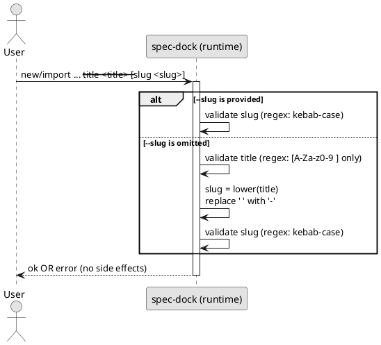
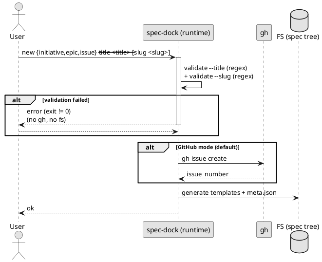
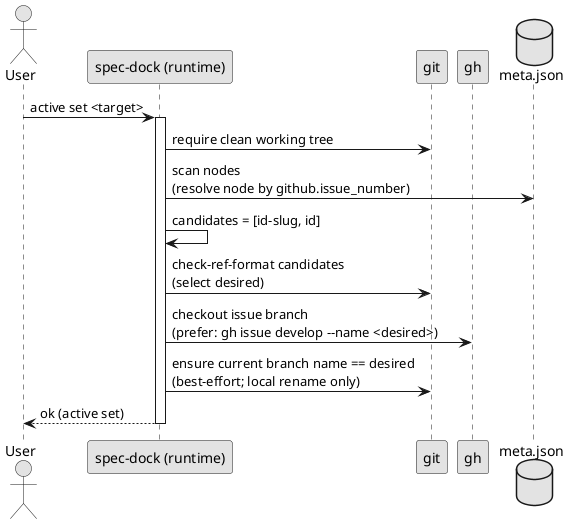

# slug 合成・バリデーション・ブランチ命名（調査メモ + 提案）

対象 Issue: https://github.com/chemitaro/spec-dock/issues/5

このドキュメントは、レビューコメントで指摘された「title/slug/ASCII/ブランチ名」の論点を、現状実装（As-Is）と提案（To-Be）として整理する補助資料です。

---

## 1. As-Is（現状実装の事実）

### 1.1 `--slug` は指定できるか？

できる。

- `new {initiative,epic,issue}` は `--slug` を受け付ける  
  `src/spec_dock/assets/spec_dock/scripts/spec-dock:2083` 付近（argparse）
- `import {initiative,epic,issue}` も `--slug` を受け付ける  
  `src/spec_dock/assets/spec_dock/scripts/spec-dock:2147` 付近（argparse）

### 1.2 title から slug はどう合成されるか？

`--slug` を渡さない場合は、内部で `_slugify(title)` が呼ばれ、その結果が `_validate_slug(slug)` で検証される。

- slug 生成: `src/spec_dock/assets/spec_dock/scripts/spec-dock:258`（`_slugify`）
- slug 検証: `src/spec_dock/assets/spec_dock/scripts/spec-dock:105`（`_validate_slug`）
- `new`（initiative/epic/issue）での使用: `src/spec_dock/assets/spec_dock/scripts/spec-dock:492` / `:564` / `:653`
- `import` での使用: `src/spec_dock/assets/spec_dock/scripts/spec-dock:1193`（`_import_slug`）→ `:1260` 以降

`_slugify` の重要な性質:

- Unicode を NFKC 正規化し、`lower()` する
- 空白やパス区切りは `-` に寄せる
- ただし `str.isalnum()` が True の文字は **そのまま保持**する  
  → 日本語（ひらがな/カタカナ/漢字）も `isalnum()` 扱いになり得るため、タイトルが日本語なら slug も日本語になり得る

`_validate_slug` の重要な性質:

- 小文字のみ（ただし日本語は `lower()` しても同じなので通る）
- 空白不可、パス区切り不可
- 許可文字: 「Unicode の英数字（`isalnum()`） + `-` `_` `.`」  
  → ここでも日本語が拒否されない

結果: 現状は「タイトルが日本語 → slug が日本語 → ディレクトリ名も日本語」になり得る。

### 1.3 `active set` はどう checkout しているか？

GitHub 紐づきの場合、`gh` を呼んで checkout する（dirty working tree の場合は安全のため中断）。

- doc: `src/spec_dock/assets/spec_dock/docs/reference_github.md`（仕様）
- code: `src/spec_dock/assets/spec_dock/scripts/spec-dock:1497` 付近（`_active_set`）
- `gh` 呼び出し: `src/spec_dock/assets/spec_dock/scripts/spec-dock:1072`（`_gh_issue_checkout`）
  - 現状は `gh issue checkout <num>` をまず試し、失敗したら `gh issue develop <num> --checkout`

結果: ブランチ名は `gh` の自動命名（Issue title 由来）に依存し、日本語タイトルで日本語ブランチ名が発生し得る。

---

## 2. To-Be（要件を満たすための仕様提案）

### 2.1 title/slug の定義（決定: 案B）

本 Issue では「ASCII かどうか」ではなく、**title/slug の許容形式を正規表現で固定**する（実装ブレを防ぐため）。

- `--title`（trim 後）: **英字/数字/スペースのみ**
  - 正規表現: `^[A-Za-z0-9]+(?: [A-Za-z0-9]+)*$`
- `--slug`（trim 後）: **kebab-case のみ**
  - 正規表現: `^[a-z0-9]+(?:-[a-z0-9]+)*$`
- `--slug` 省略時の合成（title → slug）:
  - `lower(title)` を取り、半角スペース ` ` を `-` に置換したもの

この定義により、日本語や記号を含む title/slug を入力段階で排除し、パス/ブランチ名の一貫性を担保できる。

### 2.2 ブランチ名の決定ルール（要件の中心）

desired branch name（最終的に残すブランチ名）を node の SSOT（`meta.json` の `id` と `slug`）で決める。

候補:

1. `<id>-<slug>`
2. `<id>`（フォールバック）

判定:

- 候補は ASCII であること
- さらに **git ブランチ名として有効**であること
  - 判定方法を `git check-ref-format --branch <candidate>` に固定する（レビュー指摘への回答）

### 2.3 `new/import` の副作用を起こす前のバリデーション

要件は「ASCII でない場合はエラーで中断し、副作用なし」。

副作用（例）:

- `new`（GitHub モード）: `gh issue create`
- `new/import`: `spec-dock/initiatives/**` へのファイル生成
- `import`: `gh issue view`

したがって、バリデーションは **それらの前**に必ず行う。

提案インターフェース（挙動）:

- `new`: `--title` を検証 → `slug`（明示 or `_slugify`）を確定 → `--slug` を検証 → （OKなら）gh/fs へ進む
- `import`: `--title` を検証 → `slug`（明示 or `_slugify`）を確定 → `--slug` を検証 → （OKなら）`gh issue view` へ進む

補足: import は GitHub title を取り込まない仕様なので、「GitHub 側のタイトルが非ASCII」でも、spec-dock 側の `--title` を ASCII で与えれば import 可能。

---

## 3. 仕様フロー（PlantUML）

### 3.1 slug 合成（title → slug）

### 3.2 `new`（副作用前バリデーション）

### 3.3 `active set`（checkout + ブランチ名確定）

---

## 4. 追加メモ（議論ポイント）

### 4.1 slug の許容文字セット（提案）

レビューの「ASCII 定義」と「ブランチ名として不正」の両方を満たすための、slug ルールの選択肢。

- 案A（最小変更・互換寄り）:
  - slug 許可: `[a-z0-9._-]`（lowercase ASCII、空白/区切り不可）
  - ブランチは `git check-ref-format --branch` で落ちたら `<id>` にフォールバック
  - Pros: 既存 `_validate_slug` の思想に近い／title に `.` `_` が入っても通りやすい
  - Cons: `id-slug` で揃う率は下がり得る（例: `..` を含む slug）

- 案B（強め・運用単純化）:
  - slug を kebab-case に限定: `^[a-z0-9]+(?:-[a-z0-9]+)*$`
  - Pros: ブランチ/パスとも安全性が高く、表記ゆれが減る
  - Cons: title 由来の `.` `_` などが入るとエラーになりやすい（ユーザーが `--slug` を調整する必要）

決定: **案B を採用**（slug は kebab-case、title は英字/数字/スペースのみ）。
