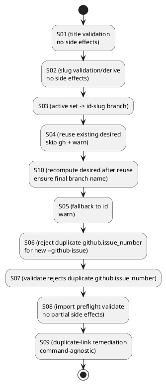

# issue-5 active set の checkout で日本語ブランチ名が生成されるのを防ぐ（id-slug 命名） — 実装計画（TDD: Red → Green → Refactor）

## この計画で満たす要件ID (必須)
- 対象AC: AC-001, AC-002, AC-003, AC-004, AC-005, AC-006, AC-007, AC-008, AC-009, AC-010, AC-011
- 対象EC: EC-001, EC-001b, EC-002, EC-003, EC-004, EC-005, EC-006
- 対象制約:
  - runtime script は stdlib のみ（依存追加なし）
  - CLI の既存インターフェース（コマンド/引数）は変更しない
  - `import` は GitHub title を取り込まない（`--title` 必須）
  - 本 Issue で追加/変更する warning は stderr に `spec-dock: (warn)` プレフィクスで出力する

## ステップ一覧（観測可能な振る舞い） (必須)
- [ ] S01: `new/import {initiative,epic,issue}` が不正な `--title` を副作用なしで拒否する
- [ ] S02: `new/import {initiative,epic,issue}` が `--slug` を kebab-case に制約し、未指定時は title から deterministic に合成する
- [ ] S03: `active set <github_issue>` 後の current ブランチが `<id>-<slug>`（不適合時 `<id>`）になり、必要に応じて warning を出す
- [ ] S04: desired branch が既存の場合、既存ブランチを再利用し warning を出す（再利用分岐では `gh issue checkout/develop` を呼ばない。内容は検証しない）
- [ ] S10: 既存ブランチ再利用後も checkout 後の node で desired を再評価し、命名正規化を保証する（slugズレ耐性）
- [ ] S05: `active set` のフォールバック（non-ascii / invalid ref）で `<id>` を採用し warning を出す
- [ ] S06: `new --github-issue` が `github.issue_number` の重複リンクを副作用なしで拒否する（initiative/epic/issue をまたぐ）
- [ ] S07: `validate` が `github.issue_number` の重複リンクを検知して失敗する（= 早期検知）
- [ ] S08: `import` が preflight validate 失敗時に副作用なしで中断する（部分的生成物を残さない）
- [ ] S09: 重複リンク拒否/検知の復旧ガイド文言をコマンド非依存にする（new/import で誤誘導しない）

### UML（任意） (任意)

### 要件 ↔ ステップ対応表 (必須)
- AC-001/AC-002 → S03, S04, S05, S10
- AC-003/AC-004 → S01
- AC-005/AC-006/AC-007 → S02
- AC-008 → S06
- AC-009 → S07
- AC-010 → S08
- AC-011 → S10
- EC-001/EC-001b → S05
- EC-002 → S03（既存の dirty working tree 拒否を維持）
- EC-003/EC-004 → S01, S02
- EC-005 → S04, S10
- EC-006 → S07（validateで早期検知。active set 側の曖昧エラーは既存挙動）
- 非交渉制約（stdlib only / CLI互換 / 副作用なし） → S01〜S05, S08, S09（各ステップでテスト/実装順序で担保）

---

## 実装ステップ（各ステップは“観測可能な振る舞い”を1つ） (必須)

### S01 — `new/import` が不正な `--title` を副作用なしで拒否する (必須)
- 対象: AC-003, AC-004 / EC-003, EC-004
- 設計参照:
  - IF-001: `_resolve_input_title_and_slug(...)`（`tmp/issue-5/design.md`）
  - バリデーションは副作用（FS/GitHub）より前に実行する（順序変更）
- このステップで「追加しないこと（スコープ固定）」:
  - `import` で GitHub title を取り込む
  - transliteration（日本語→ローマ字）による変換

#### update_plan（着手時に登録） (必須)
- [ ] `update_plan` に、このステップの作業ステップ（調査/Red/Green/Refactor/品質ゲート/報告）を登録した

#### 期待する振る舞い（テストケース） (必須)
- Given: `--title` が `^[A-Za-z0-9]+(?: [A-Za-z0-9]+)*$` を満たさない（例: `Add-Token` / `日本語` / `Add　Token`）
- When: `new/import {initiative,epic,issue}` を実行する
- Then: exit code != 0 で中断し、stderr に `--title` と正規表現と OK/NG 例を含む
- 観測点: exit code / stderr / FS（生成物なし）/ GitHub（`gh` 未実行）

#### Red（失敗するテストを先に書く） (任意)
- `tests/test_cli.py` に以下を追加（または既存の期待を更新）:
  - `new` の invalid title で失敗し、ディレクトリが増えない
  - `import` の invalid title で失敗し、`gh issue view` が呼ばれない（スタブ/ログで検証）

#### Green（最小実装） (任意)
- 変更予定ファイル:
  - Modify: `src/spec_dock/assets/spec_dock/scripts/spec-dock`
- 実装方針:
  - title を `strip()` して正規表現で検証（保存する title も trim 後へ統一）
  - 失敗時は `RuntimeError` で中断（副作用前）

#### ステップ末尾（省略しない） (必須)
- [ ] `python -m unittest -q` を実行し、成功した
- [ ] `tmp/issue-5/report.md` に実行コマンド/結果/変更ファイルを記録した
- [ ] `update_plan` を更新し、このステップを完了にした
- [ ] （任意）ユーザー指示がある場合のみコミットした

---

### S02 — `new/import` が `--slug` を kebab-case に制約し、未指定時は title から合成する (必須)
- 対象: AC-005, AC-006, AC-007 / EC-003, EC-004
- 設計参照:
  - IF-001: `_resolve_input_title_and_slug(...)`
  - 既存 `_validate_slug` は温存し、入力専用の別名バリデータ（kebab-case）を追加する（後方互換のため）

#### update_plan（着手時に登録） (必須)
- [ ] `update_plan` に、このステップの作業ステップ（調査/Red/Green/Refactor/品質ゲート/報告）を登録した

#### 期待する振る舞い（テストケース） (必須)
- Given: `--title "Add Refresh Token"`（`--slug` 省略）
- When: `new initiative --no-github --id init-local-00001 --title "Add Refresh Token"` を実行する
- Then: 作成された node の `meta.json.slug == "add-refresh-token"` になる
- 観測点: FS（`spec-dock/initiatives/**/meta.json`）
- Given: `--title "Add Refresh Token"` かつ `--slug "Bad!Slug"`（kebab-case ではない）
- When: `new/import {initiative,epic,issue}` を実行する
- Then: exit code != 0 で中断し、stderr に `--slug` と正規表現と OK/NG 例を含む（副作用なし）
- 観測点: exit code / stderr / FS（生成物なし）/ GitHub（`gh` 未実行）

#### Red（失敗するテストを先に書く） (任意)
- `tests/test_cli.py` に「title→slug 合成の成功系」テストを追加
- 既存の slug テスト（unsafe/uppercase）は維持しつつ、エラーメッセージに正規表現と OK/NG 例が含まれることを追加で検証（必要なら）

#### Green（最小実装） (任意)
- 変更予定ファイル:
  - Modify: `src/spec_dock/assets/spec_dock/scripts/spec-dock`
- 実装方針:
  - `slug = slug.strip()` を正規化し、`^[a-z0-9]+(?:-[a-z0-9]+)*$` で検証
  - `--slug` 未指定時は `slug = lower(title)`、` ` → `-` で合成してから検証
  - バリデーションは副作用前（S01 と同様）

#### ステップ末尾（省略しない） (必須)
- [ ] `python -m unittest -q` を実行し、成功した
- [ ] `tmp/issue-5/report.md` に実行コマンド/結果/変更ファイルを記録した
- [ ] `update_plan` を更新し、このステップを完了にした
- [ ] （任意）ユーザー指示がある場合のみコミットした

---

### S03 — `active set` 後の current ブランチ名が `<id>-<slug>` / `<id>` に確定する (必須)
- 対象: AC-001, AC-002 / EC-002
- 設計参照:
  - IF-002: `_desired_branch_name(node, repo_root) -> BranchDecision`
  - IF-003: `_ensure_desired_branch(repo_root, decision)`
  - `git check-ref-format --branch` と `isascii()`（`str.isascii()` 相当）で候補を確定する

#### update_plan（着手時に登録） (必須)
- [ ] `update_plan` に、このステップの作業ステップ（調査/Red/Green/Refactor/品質ゲート/報告）を登録した

#### 期待する振る舞い（テストケース） (必須)
- Given: GitHub issue #123 に link された node が存在し、working tree が clean
- When: `active set 123`
- Then: `git rev-parse --abbrev-ref HEAD` が `iss-00123-add-refresh-token` になる（通常ケース）
- 観測点: `git rev-parse --abbrev-ref HEAD` / `spec-dock/.agent/active.json`

#### Red（失敗するテストを先に書く） (任意)
- `tests/test_cli.py::test_active_set_github_issue_checkout_sets_active` にブランチ名のアサーションを追加
- （非回帰）local-only node を `active set <node_id>` しても current branch が変わらないことをテストで固定する（将来のリファクタでブランチを触る事故を防ぐ）

#### Green（最小実装） (任意)
- 変更予定ファイル:
  - Modify: `src/spec_dock/assets/spec_dock/scripts/spec-dock`
- 実装方針:
  - ブランチ名を寄せる処理は「GitHub 紐づきで checkout を伴う場合のみ」実行する（local-only node は対象外）
  - checkout 後に scan→再解決を行い、ブランチ切替後のツリーと active 更新のズレを防ぐ（設計どおり）

#### ステップ末尾（省略しない） (必須)
- [ ] `python -m unittest -q` を実行し、成功した
- [ ] `tmp/issue-5/report.md` に実行コマンド/結果/変更ファイルを記録した
- [ ] `update_plan` を更新し、このステップを完了にした
- [ ] （任意）ユーザー指示がある場合のみコミットした

---

### S04 — desired branch 既存時は再利用して `gh` をスキップし warning を出す (必須)
- 対象: EC-005
- 設計参照:
  - 既存ブランチ再利用分岐では `gh issue checkout/develop` を呼ばない（副作用最小化）
  - stderr に `spec-dock: (warn)` + `reusing existing branch` + `content is not verified` を含む warning

#### update_plan（着手時に登録） (必須)
- [ ] `update_plan` に、このステップの作業ステップ（調査/Red/Green/Refactor/品質ゲート/報告）を登録した

#### 期待する振る舞い（テストケース） (必須)
- Given:（scan で node が解決でき、checkout を伴う `gh` 呼び出しが不要な状況で）desired branch が既にローカルに存在する
- When: `active set <github_issue>`
- Then:
  - `gh issue checkout/develop` を呼ばず、既存ブランチを checkout して続行する
  - stderr に warning（`spec-dock: (warn)` + `reusing existing branch` + `content is not verified`）が出る
- 観測点: gh スタブのログ/回数 / current branch / stderr

#### Green（最小実装） (任意)
- `git show-ref --verify refs/heads/<desired>` 等で存在判定し、存在する場合は `git checkout <desired>` へ分岐
  - 補足: checkout 後の node で desired を再評価し命名正規化を保証するケースは S10 で固定する

#### ステップ末尾（省略しない） (必須)
- [ ] `python -m unittest -q` を実行し、成功した
- [ ] `tmp/issue-5/report.md` に実行コマンド/結果/変更ファイルを記録した
- [ ] `update_plan` を更新し、このステップを完了にした
- [ ] （任意）ユーザー指示がある場合のみコミットした

---

### S10 — 既存ブランチ再利用後に desired を再評価して命名正規化を保証する (必須)
- 対象: AC-011 / EC-005
- 設計参照:
  - Flow for AC-001/002（`active set`）の「既存ブランチ再利用」でも checkout 後に scan→再解決→desired 再計算→ブランチ名を寄せる（`tmp/issue-5/design.md`）
- 狙い:
  - 既存ブランチ再利用分岐で `decision` を checkout 前の `meta.json` から計算してしまうと、ブランチ間で `slug` がズレたケースで最終ブランチ名が `<id>-<slug>` にならず、命名正規化の保証が崩れるため。

#### update_plan（着手時に登録） (必須)
- [ ] `update_plan` に、このステップの作業ステップ（調査/Red/Green/Refactor/品質ゲート/報告）を登録した

#### 期待する振る舞い（テストケース） (必須)
- Given:
  - GitHub 紐づき node（例: `iss-00123` / `github.issue_number=123`）が存在する
  - 既存ローカルブランチ `iss-00123-add-refresh-token` が存在し、checkout すると node の `meta.json.slug` が `refresh-token` に変化する（= ブランチ間で `slug` がズレている状態）
- When: `active set 123`（または URL）を実行する（既存ブランチ再利用分岐に入る）
- Then:
  - 最終的な `git rev-parse --abbrev-ref HEAD` が `iss-00123-refresh-token` になる（checkout 後に再計算した desired へ寄る）
  - `gh issue checkout/develop` は呼ばれない（既存ブランチ再利用のまま）

#### Red（失敗するテストを先に書く） (任意)
- `tests/test_cli.py` に「slugズレ + 既存ブランチ再利用」の回帰テストを追加する:
  - 例: 既存ブランチ `iss-00123-add-refresh-token` 上で `meta.json.slug=refresh-token` に改変 → 別ブランチから `active set 123` → 最終ブランチ名が `iss-00123-refresh-token`

#### Green（最小実装） (任意)
- `src/spec_dock/assets/spec_dock/scripts/spec-dock::_active_set` にて:
  - 既存ブランチ再利用で `git checkout <decision.desired>` した後、必ず scan→再解決→`decision` 再計算を行う
  - 再計算した `decision.desired` に対して `_ensure_active_set_branch_name(...)` を実行し、最終ブランチ名を確定させる（必要なら rename/switch）
  - 同様の再利用分岐を node-id 経路（GitHub 紐づき node 選択）にも適用する

#### ステップ末尾（省略しない） (必須)
- [ ] `python -m unittest -q` を実行し、成功した
- [ ] `tmp/issue-5/report.md` に実行コマンド/結果/変更ファイルを記録した
- [ ] `update_plan` を更新し、このステップを完了にした
- [ ] （任意）ユーザー指示がある場合のみコミットした

---

### S05 — `active set` が `<id>` へフォールバックし warning を出す (必須)
- 対象: EC-001, EC-001b
- 設計参照:
  - `id-slug` が non-ascii または invalid ref の場合に `<id>` を採用する（エラーで止めない）
  - stderr に `spec-dock: (warn)` + `fallback to id` を含む warning

#### update_plan（着手時に登録） (必須)
- [ ] `update_plan` に、このステップの作業ステップ（調査/Red/Green/Refactor/品質ゲート/報告）を登録した

#### 期待する振る舞い（テストケース） (必須)
- Given: legacy/既存データとして `node.slug` が non-ascii（例: `日本語`）または invalid ref（例: `a..b`）になっている
- When: `active set <github_issue>`
- Then:
  - current branch が `<id>` になる
  - stderr に warning（`spec-dock: (warn)` + `fallback to id`）が出る

#### Red（失敗するテストを先に書く） (任意)
- テストの作り方（どちらかを採用）:
  - A: テスト用にディレクトリ/`meta.json` を直接作り、scan 対象に入れる（既存データ想定）
  - B: 既存 node を作成後に `meta.json` の `slug` を改変して simulate する（scan が meta を採用する前提なら簡便）

#### ステップ末尾（省略しない） (必須)
- [ ] `python -m unittest -q` を実行し、成功した
- [ ] `tmp/issue-5/report.md` に実行コマンド/結果/変更ファイルを記録した
- [ ] `update_plan` を更新し、このステップを完了にした
- [ ] （任意）ユーザー指示がある場合のみコミットした

---

### S06 — `new --github-issue` が重複リンクを副作用なしで拒否する (必須)
- 対象: AC-008
- 設計参照:
  - IF-004: `_ensure_github_issue_not_linked(...)`（`tmp/issue-5/design.md`）
- 狙い:
  - `new --github-issue <n>` で `github.issue_number` を重複リンクできると、後続の `active set <n|url>` が `Ambiguous github.issue_number=<n>` で失敗し運用不能になるため、生成源で止める。

#### update_plan（着手時に登録） (必須)
- [ ] `update_plan` に、このステップの作業ステップ（調査/Red/Green/Refactor/品質ゲート/報告）を登録した

#### 期待する振る舞い（テストケース） (必須)
- Given: `github.issue_number=1` を持つ node が既に存在する（例: `new initiative --github-issue 1 ...` 済み）
- When: 別の node を `new ... --github-issue 1` で作成しようとする（initiative/epic/issue のいずれでも）
- Then: exit code != 0 で失敗し、stderr に `github.issue_number=1` と競合 node の `type:id` / `meta.json` パスが分かる情報を含む（副作用なし）
- 観測点: exit code / stderr / FS（新しい node が増えていない）

#### Red（失敗するテストを先に書く） (任意)
- `tests/test_cli.py` に重複リンク再現（manual test DEF-001）を固定するテストを追加:
  - 例: `new initiative --github-issue 1` → `new issue --github-issue 1` が失敗すること

#### Green（最小実装） (任意)
- `src/spec_dock/assets/spec_dock/scripts/spec-dock` の `new {initiative,epic,issue}`（`--github-issue` による既存番号リンクの経路）にて:
  - `--github-issue` が指定された経路（既存番号リンク）で、FS 生成前に scan nodes → `_ensure_github_issue_not_linked(nodes, issue_number=github_issue_number)` を適用する

#### ステップ末尾（省略しない） (必須)
- [ ] `python -m unittest -q` を実行し、成功した
- [ ] `tmp/issue-5/report.md` に実行コマンド/結果/変更ファイルを記録した
- [ ] `update_plan` を更新し、このステップを完了にした
- [ ] （任意）ユーザー指示がある場合のみコミットした

---

### S07 — `validate` が `github.issue_number` の重複リンクを検知して失敗する (必須)
- 対象: AC-009 / EC-006
- 設計参照:
  - IF-005: `_validate_github_issue_numbers_unique(nodes)`（`tmp/issue-5/design.md`）
- 狙い:
  - “`validate` は通るのに `active set <number|url>` が壊れる” 状態を作らない（早期検知）。

#### update_plan（着手時に登録） (必須)
- [ ] `update_plan` に、このステップの作業ステップ（調査/Red/Green/Refactor/品質ゲート/報告）を登録した

#### 期待する振る舞い（テストケース） (必須)
- Given: 仕様ツリーに `github.issue_number=1` を持つ node が複数存在する（手編集/過去バグ由来）
- When: `./spec-dock/scripts/spec-dock validate` を実行する
- Then: exit code != 0 で失敗し、stderr に重複内容（`github.issue_number=1` と該当 node の `type:id` / `meta.json` パス）が分かる

#### Red（失敗するテストを先に書く） (任意)
- `tests/test_cli.py` に “重複リンクを meta.json の書き換えで作る” テストを追加し、`validate` が失敗することを固定する

#### Green（最小実装） (任意)
- `src/spec_dock/assets/spec_dock/scripts/spec-dock::_validate_nodes` に、`github.issue_number` の重複検知を追加する（initiative/epic/issue をまたぐ）

#### ステップ末尾（省略しない） (必須)
- [ ] `python -m unittest -q` を実行し、成功した
- [ ] `tmp/issue-5/report.md` に実行コマンド/結果/変更ファイルを記録した
- [ ] `update_plan` を更新し、このステップを完了にした
- [ ] （任意）ユーザー指示がある場合のみコミットした

---

### S08 — `import` が preflight validate 失敗時に副作用なしで中断する (必須)
- 対象: AC-010
- 設計参照:
  - ERR-004: Import preflight validate failed（`tmp/issue-5/design.md`）
- 狙い:
  - 既存リポジトリが不整合（`validate` 失敗）な場合でも、`import` がテンプレート/`meta.json` を作った後に落ちて “中途半端な生成物” が残る状態を防ぐ。

#### update_plan（着手時に登録） (必須)
- [ ] `update_plan` に、このステップの作業ステップ（調査/Red/Green/Refactor/品質ゲート/報告）を登録した

#### 期待する振る舞い（テストケース） (必須)
- Given: 仕様ツリーが不整合で `validate` が失敗する（例: `github.issue_number=1` が複数 node に重複している）
- When: `import initiative 123 --title "Imported Initiative"`（または epic/issue）を実行する
- Then:
  - exit code != 0 で失敗し、stderr に `preflight validate failed` を含む
  - `spec-dock/initiatives/**` に新しい `init-00123-*`（または `epic-00123-*` / `iss-00123-*`）ディレクトリが増えていない

#### Red（失敗するテストを先に書く） (任意)
- `tests/test_cli.py` に “既存ツリーが壊れている状態で import を実行しても、生成物が残らない” テストを追加する

#### Green（最小実装） (任意)
- `src/spec_dock/assets/spec_dock/scripts/spec-dock::_import_{initiative,epic,issue}` にて:
  - 副作用（テンプレートコピー/`meta.json`生成）前に scan nodes → `_validate_nodes(...)` を実行し、失敗したら `RuntimeError` で中断する
  - 実行順序は `preflight validate` → `gh issue view` → FS 生成で固定する

#### ステップ末尾（省略しない） (必須)
- [ ] `python -m unittest -q` を実行し、成功した
- [ ] `tmp/issue-5/report.md` に実行コマンド/結果/変更ファイルを記録した
- [ ] `update_plan` を更新し、このステップを完了にした
- [ ] （任意）ユーザー指示がある場合のみコミットした

---

### S09 — 重複リンク拒否/検知の復旧ガイド文言をコマンド非依存にする (必須)
- 対象: 非交渉制約（復旧ガイドはコマンド非依存） / ERR-003
- 設計参照:
  - IF-004: `_ensure_github_issue_not_linked(...)`（`tmp/issue-5/design.md`）
- 狙い:
  - `import` で重複リンクに当たった際に「別の `--github-issue` を選ぶ」等の誤誘導が出ないようにし、復旧を速める。

#### update_plan（着手時に登録） (必須)
- [ ] `update_plan` に、このステップの作業ステップ（調査/Red/Green/Refactor/品質ゲート/報告）を登録した

#### 期待する振る舞い（テストケース） (必須)
- Given: `github.issue_number=123` を持つ node が既に存在する
- When: `import issue 123 --title "Import Attempt" --epic <...>`（例）を実行する
- Then:
  - exit code != 0 で失敗し、stderr に `github.issue_number=123` と競合 node の `type:id` / `meta.json` パスが分かる情報を含む
  - 復旧ガイド文言が **コマンド非依存**（`--github-issue` 等の特定フラグ名を前提としない）である
  - stderr に `--github-issue` を含まない（誤誘導を防ぐ）

#### Red（失敗するテストを先に書く） (任意)
- 既存の import 重複リンク拒否テストに「誤誘導がない」観測点を追加する（例: `--github-issue` を含まない、等）

#### Green（最小実装） (任意)
- `_ensure_github_issue_not_linked(...)` の例外文言を修正し、`new/import` 双方で意味が通る文言へ寄せる

#### ステップ末尾（省略しない） (必須)
- [ ] `python -m unittest -q` を実行し、成功した
- [ ] `tmp/issue-5/report.md` に実行コマンド/結果/変更ファイルを記録した
- [ ] `update_plan` を更新し、このステップを完了にした
- [ ] （任意）ユーザー指示がある場合のみコミットした

---

## 未確定事項（TBD） (必須)
- 該当なし（要件/設計で確定済み）

## 完了条件（Definition of Done） (必須)
- 対象AC/ECがすべて満たされ、テストで保証されている
- MUST NOT / OUT OF SCOPE を破っていない
- 品質ゲート（フォーマット/リント/テストのうち該当するもの）が満たされている

## 省略/例外メモ (必須)
- 該当なし
