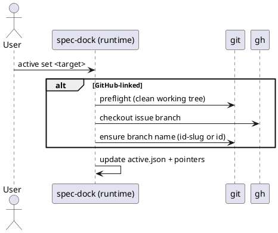

# issue-5 active set の checkout で日本語ブランチ名が生成されるのを防ぐ（id-slug 命名） — 要件定義（WHAT / WHY）

## 目的（ユーザーに見える成果 / To-Be） (必須)
- `active set` による GitHub Issue checkout 時、最終的に checkout されるブランチ名が **ASCII の決定的な形式**（原則 `id-slug`、不適合時は `id`）になり、日本語ブランチ名が残らない。
- `new/import {initiative,epic,issue}` の `--title` に ASCII 制約を課し、ASCII 非対応タイトルによる slug/ブランチ名の崩れを **作成時点で防止**できる。

## 背景・現状（As-Is / 調査メモ） (必須)
- 現状の挙動（事実）:
  - `active set <github_issue_number>` は、GitHub 紐づきノードを対象に **checkout を伴う**（安全装置として dirty working tree では中断）。`src/spec_dock/assets/spec_dock/docs/reference_github.md`
  - 実装は `gh issue checkout <num>`（失敗時 `gh issue develop <num> --checkout`）で checkout を行っている。`src/spec_dock/assets/spec_dock/scripts/spec-dock:1072`（`_gh_issue_checkout`）
  - その結果、`gh` 側の自動生成ブランチ名（Issue title 由来）に依存し、Issue title が日本語の場合に **日本語ブランチ名**が生成され得る。
  - `new {initiative,epic,issue}` は現状 `--title` の空チェックのみで、ASCII 制約は無い。`src/spec_dock/assets/spec_dock/scripts/spec-dock:492`（`_new_initiative`）/ `:564`（`_new_epic`）/ `:653`（`_new_issue`）
  - slug 生成は `_slugify` で、Unicode の `isalnum()` を保持するため、日本語タイトル→日本語 slug が生成され得る。`src/spec_dock/assets/spec_dock/scripts/spec-dock:258`（`_slugify`）/ `:105`（`_validate_slug`）
- 現状の課題（困っていること）:
  - 日本語ブランチ名は、環境/ツール（シェル、CI、周辺スクリプト、正規表現前提、運用ルール）により取り回しが悪く、チーム運用上の事故原因になり得る。
  - spec-dock 自身もブランチ名から node を推測する“ベストエフォート”実装を持っており、ブランチに `iss-00123` のような **id が含まれる**のが望ましい（運用上の一貫性）。`src/spec_dock/assets/spec_dock/scripts/spec-dock:48`（コメント）/ `:1693`（`_infer_active_node_from_branch`）
- 再現手順（最小で）:
  1) GitHub 側で日本語タイトルの Issue を作成する
  2) ローカルで working tree を clean にした上で `./spec-dock/scripts/spec-dock active set <issue_number>` を実行する
  3) `git rev-parse --abbrev-ref HEAD` でブランチ名を確認する（日本語が含まれる可能性がある）
- 観測点（どこを見て確認するか）:
  - Git: `git rev-parse --abbrev-ref HEAD`（最終ブランチ名）
  - Git: `git status --porcelain`（dirty で checkout が拒否されること）
  - CLI 出力: `spec-dock: ok (active set) ...`
  - 状態ファイル: `spec-dock/.agent/active.json`（active が更新されていること）
- 実際の観測結果（貼れる範囲で）:
  - Input/Operation: （ユーザーヒアリング）Issue title が日本語のケースで、日本語ブランチ名が生成される事象が多発
  - Output/State: checkout 時に `gh` の自動命名に依存しているため、再現し得る
- 情報源（ヒアリング/調査の根拠）:
  - Issue/チケット: GitHub Issue #5（本件）
  - ドキュメント:
    - `src/spec_dock/assets/spec_dock/docs/reference_github.md`（`active set` が checkout を伴うこと）
  - コード:
    - `src/spec_dock/assets/spec_dock/scripts/spec-dock`（runtime script）
      - `_gh_issue_checkout`（`gh issue checkout/develop` 実行）: 1072 行付近
      - `_active_set`（checkout→scan→active 更新）: 1497 行付近
      - `_new_{initiative,epic,issue}`（title/slug の扱い）: 492/564/653 行付近
      - `_slugify` / `_validate_slug`（slug の仕様）: 258/105 行付近
  - CLI:
    - `gh issue develop --help` に `--name` オプションが存在（ブランチ名指定の手段）

## 対象ユーザー / 利用シナリオ (任意)
- 主な利用者（ロール）:
  - spec-dock を導入したリポジトリで、GitHub Issues と連携して作業ブランチを切る開発者
- 代表的なシナリオ:
  - GitHub Issue（initiative/epic/issue）を作成 → `active set` で対象を切り替え → 仕様/実装作業に入る
  - `new issue` でノードを作成し、同時に GitHub Issue を作成して運用する

### UML（任意） (任意)

## スコープ（暴走防止のガードレール） (必須)
- MUST（必ずやる）:
  - `active set` の checkout 結果として残るブランチ名を、spec-dock のメタデータ（`id` + `slug`）に基づき決定する
    - 原則: `<node_id>-<slug>`
    - フォールバック: `<node_id>`（`<node_id>-<slug>` が「ASCII でない」または「git ブランチ名として不正」な場合）
    - prefix（例: `feature/`）は付けない
  - 対象ノード種別: initiative / epic / issue（GitHub 紐づきノード）
  - `new {initiative,epic,issue}` は `--title` を ASCII のみに制限し、非ASCIIの場合は **エラーで中断**する（副作用なし）
  - `new {initiative,epic,issue}` は `--slug`（明示指定/自動生成の結果）も ASCII のみに制限し、非ASCIIの場合は **エラーで中断**する（副作用なし）
  - `import {initiative,epic,issue}` は `--title` を ASCII のみに制限し、非ASCIIの場合は **エラーで中断**する（副作用なし）
  - `import {initiative,epic,issue}` は `--slug`（明示指定/自動生成の結果）も ASCII のみに制限し、非ASCIIの場合は **エラーで中断**する（副作用なし）
- MUST NOT（絶対にやらない／追加しない）:
  - リモートブランチのリネーム/削除/強制更新（force push）を行わない
  - GitHub Issue 本体（title/body/labels 等）の自動変更を追加しない（本件の目的外）
- OUT OF SCOPE:
  - ブランチ名の prefix カスタマイズ（設定ファイル化など）
  - 多言語タイトルを許容したまま “常に id-slug を生成できる” 高度な transliteration（ローマ字変換等）
  - cross-repo（URL の owner/repo を尊重する等）の安全拡張

## 境界（Always / Ask / Never） (必須)
- Always（常に守る）:
  - checkout 前に dirty working tree を検出して安全に中断する（既存の安全装置を維持）
  - `active set` の結果ブランチ名は ASCII である
- Ask（迷ったら相談）:
  - 該当なし（運用要件は確定）
- Never（絶対にしない）:
  - 既存の Git 履歴を書き換える操作（rebase 強制、reset --hard など）を spec-dock が自動で行う
  - 失敗時にユーザーの作業ツリーを壊す（中途半端な生成物だけ残す等）

## 非交渉制約（守るべき制約） (必須)
- 例: 既存API互換を維持する
- 例: 依存追加はしない（必要なら要件に明記）
- 例: セキュリティ/プライバシー要件（ログ、マスキング、権限制御など）
- 例: 性能（p95など）やSLO
- runtime script は stdlib のみ（依存追加なし）
- CLI の既存インターフェース（コマンド/引数）は変更しない（`active set <target>` / `new ... --title ...` を維持）
- エラー時は可能な限り「副作用なし」（少なくとも `new/import` の title/slug バリデーション失敗時は FS/GitHub への書き込み無し）

## 前提（Assumptions） (必須)
- 例: 対象ユーザーは〜である
- 例: 既存データは〜の状態である
- GitHub 連携モードでは `git` と `gh` が利用可能で、`gh auth` 済みである
- `active set` による checkout を行うとき、ユーザーは working tree を clean にできる（安全装置により必須）

## 判断材料/トレードオフ（Decision / Trade-offs） (任意)
- 論点: タイトルを ASCII のみに制限すると、日本語で管理したいユーザーは不便になる
  - 決定: `new/import` の `--title` を ASCII のみに制限する（今回の運用要件）
  - 理由: slug/パス/ブランチ名の一貫性と、ツールチェーン互換性を優先する

## リスク/懸念（Risks） (任意)
- R-001: 既存ユーザーが日本語 `--title`（または `--slug`）を使っていた場合に破壊的変更になる（影響: `new/import` が失敗する / 対応: リリースノート明記、代替（英語タイトル）提示）
- R-002: `id-slug` が git ブランチ名として不正なケース（例: `..` を含む等）により checkout/rename が失敗する（影響: `active set` が失敗 / 対応: git 妥当性チェック + `id` へのフォールバック）

## 受け入れ条件（観測可能な振る舞い） (必須)
- AC-001:
  - Actor/Role: 開発者（GitHub 連携運用）
  - Given: GitHub 紐づきノード（initiative/epic/issue）の branch checkout が可能（working tree clean）
  - When: `./spec-dock/scripts/spec-dock active set <github_issue_number>` を実行する
  - Then: `git rev-parse --abbrev-ref HEAD` の結果が以下のいずれかになる
    - 1) `<node_id>-<slug>`（ASCII かつ git ブランチ名として有効）
    - 2) `<node_id>`（フォールバック）
  - 観測点（UI/HTTP/DB/Log など）:
    - Git: `git rev-parse --abbrev-ref HEAD`
    - File: `spec-dock/.agent/active.json` が更新され、対象ノードが active になっている
- AC-002:
  - Actor/Role: 開発者（GitHub 連携運用）
  - Given: GitHub 紐づきノードの id が分かっている（例: `iss-00123`）
  - When: `./spec-dock/scripts/spec-dock active set <node_id>` を実行する（対象が GitHub 紐づきの場合 checkout を伴う）
  - Then: AC-001 と同じブランチ命名規則が満たされる
  - 観測点:
    - Git: `git rev-parse --abbrev-ref HEAD`
    - File: `spec-dock/.agent/active.json`
- AC-003:
  - Actor/Role: spec-dock 利用者
  - Given: `new` コマンドを実行できる
  - When: `./spec-dock/scripts/spec-dock new {initiative,epic,issue} --title "<非ASCIIを含む>"` を実行する
  - Then: コマンドは失敗し、明確なエラーメッセージを出して中断する（GitHub/FS の副作用なし）
  - 観測点:
    - CLI: exit code != 0、stderr に `--title` と `ASCII` を含む（文言は実装で確定）
    - FS: 対象の `spec-dock/initiatives/**` 以下が増えていない
    - GitHub:（GitHub モードでも）`gh issue create` が呼ばれない
- AC-004:
  - Actor/Role: spec-dock 利用者
  - Given: `import` コマンドを実行できる
  - When: `./spec-dock/scripts/spec-dock import {initiative,epic,issue} <num|#num|url> --title "<非ASCIIを含む>"` を実行する
  - Then: コマンドは失敗し、明確なエラーメッセージを出して中断する（FS/GitHub の副作用なし）
  - 観測点:
    - CLI: exit code != 0、stderr に `--title` と `ASCII` を含む（文言は実装で確定）
    - FS: 対象の `spec-dock/initiatives/**` 以下が増えていない
    - GitHub: `gh issue view` が呼ばれない（入力バリデーションで早期中断）
- AC-005:
  - Actor/Role: spec-dock 利用者
  - Given: `new` コマンドを実行できる
  - When: `./spec-dock/scripts/spec-dock new {initiative,epic,issue} --title "<ASCII>" --slug "<非ASCIIを含む>"` を実行する
  - Then: コマンドは失敗し、明確なエラーメッセージを出して中断する（GitHub/FS の副作用なし）
  - 観測点:
    - CLI: exit code != 0、stderr に `--slug` と `ASCII` を含む（文言は実装で確定）
    - FS: 対象の `spec-dock/initiatives/**` 以下が増えていない
    - GitHub:（GitHub モードでも）`gh issue create` が呼ばれない
- AC-006:
  - Actor/Role: spec-dock 利用者
  - Given: `import` コマンドを実行できる
  - When: `./spec-dock/scripts/spec-dock import {initiative,epic,issue} <num|#num|url> --title "<ASCII>" --slug "<非ASCIIを含む>"` を実行する
  - Then: コマンドは失敗し、明確なエラーメッセージを出して中断する（FS/GitHub の副作用なし）
  - 観測点:
    - CLI: exit code != 0、stderr に `--slug` と `ASCII` を含む（文言は実装で確定）
    - FS: 対象の `spec-dock/initiatives/**` 以下が増えていない
    - GitHub: `gh issue view` が呼ばれない（入力バリデーションで早期中断）

### 入力→出力例 (任意)
- EX-001:
  - Input: node_id=`iss-00123`, slug=`add-refresh-token`
  - Output: branch=`iss-00123-add-refresh-token`
- EX-002:
  - Input: node_id=`epic-00124`, slug=`a..b`（git ブランチ不正になり得る）
  - Output: branch=`epic-00124`（フォールバック）

## 例外・エッジケース（仕様として固定） (必須)
- EC-001:
  - 条件: 対象ノードの `id-slug` が ASCII でない（例: 既存データで slug が日本語）
  - 期待: ブランチ名は `<id>` へフォールバックする（エラーで止めない）
  - 観測点: `git rev-parse --abbrev-ref HEAD`
- EC-002:
  - 条件: working tree が dirty
  - 期待: checkout を行わずエラーで中断する（既存挙動維持）
  - 観測点: stderr に “Working tree is not clean” を含む / ブランチが変わらない
- EC-003:
  - 条件: `new` の `--title` または `--slug` が ASCII でない
  - 期待: `new` はエラーで中断し、ファイル生成も GitHub 連携も行わない
  - 観測点: exit code / `spec-dock/initiatives/**` の不変 / `gh` 未実行（テストで保証）
- EC-004:
  - 条件: `import` の `--title` または `--slug` が ASCII でない
  - 期待: `import` はエラーで中断し、ファイル生成も GitHub 参照も行わない
  - 観測点: exit code / `spec-dock/initiatives/**` の不変 / `gh` 未実行（テストで保証）

## 用語（ドメイン語彙） (必須)
- TERM-001: node = `meta.json` を持つ initiative/epic/issue（spec-dock の管理単位）
- TERM-002: GitHub 紐づきノード = `meta.json` に `github.issue_number` を持つ node
- TERM-003: id = `iss-00123` のような node 識別子（type prefix + 数値、基本 ASCII）
- TERM-004: slug = タイトル等から生成された path セグメント（`id-slug` ディレクトリ名にも使う）
- TERM-005: desired branch name = `active set` 後に最終的に残すブランチ名（本件の命名規則に従う）

## 未確定事項（TBD / 要確認） (必須)
- Q-001: 解消
  - 決定: `new` の `--slug` にも ASCII 制約を課す
- Q-002: 解消
  - 決定: `import {initiative,epic,issue}` の `--title` / `--slug` にも ASCII 制約を課す

## Definition of Ready（着手可能条件） (必須)
- [ ] 目的が 1〜3行で明確になっている
- [ ] MUST/MUST NOT/OUT OF SCOPE が書けている
- [ ] Always/Ask/Never が書けている
- [ ] AC/EC が観測可能（テスト可能）な形になっている
- [ ] 観測点（UI/HTTP/DB/Log など）または確認方法が明記されている
- [ ] 未確定事項が「質問/選択肢/推奨案/影響範囲」で整理されている

## 完了条件（Definition of Done） (必須)
- すべてのAC/ECが満たされる
- 未確定事項が解消される（残す場合は「残す理由」と「合意」を明記）
- MUST NOT / OUT OF SCOPE を破っていない

## 省略/例外メモ (必須)
- 該当なし
