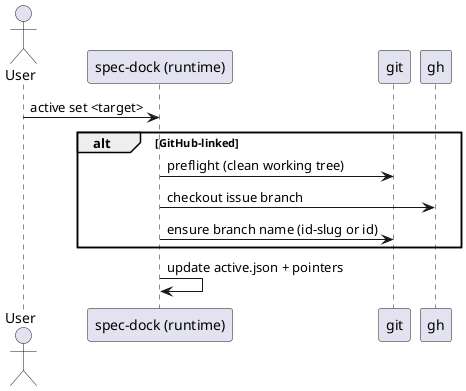

# issue-5 active set の checkout で日本語ブランチ名が生成されるのを防ぐ（id-slug 命名） — 要件定義（WHAT / WHY）

## 目的（ユーザーに見える成果 / To-Be） (必須)
- `active set` による GitHub Issue checkout 時、`active set` の結果として checkout されているブランチ名（current）が **ASCII** かつ **`git check-ref-format --branch` を満たす**決定的な形式（原則 `id-slug`、不適合時は `id`）になる（＝非ASCIIにならない）。
- `new/import {initiative,epic,issue}` の `--title` / `--slug` を、`--title` は「半角スペース区切りの英数字トークン列（trim、連続スペース不可）」、`--slug` は kebab-case のみに制約し、日本語タイトル等による path/ブランチ名の崩れを **作成時点で防止**できる。
- `github.issue_number` を持つ node（initiative/epic/issue）は **ツリー全体で一意**となり、`active set <github_issue_number|url>` が曖昧にならない（＝ spec-dock が “運用不能な状態” を作れない / 早期に検知できる）。
- `import {initiative,epic,issue}` は **既存ツリーが不整合（validate失敗）な場合**、新規ディレクトリ/`meta.json` を作らずに中断できる（部分的な副作用が残らない）。

## 背景・現状（As-Is / 調査メモ） (必須)
- 現状の挙動（事実）:
  - `active set <github_issue_number>` は、GitHub 紐づきノードを対象に **checkout を伴う**（安全装置として dirty working tree では中断）。`src/spec_dock/assets/spec_dock/docs/reference_github.md`
  - 実装は `gh issue checkout <num>`（失敗時 `gh issue develop <num> --checkout`）で checkout を行っている。`src/spec_dock/assets/spec_dock/scripts/spec-dock:1072`（`_gh_issue_checkout`）
  - その結果、`gh` 側の自動生成ブランチ名（Issue title 由来）に依存し、Issue title が日本語の場合に **日本語ブランチ名**が生成され得る。
  - `new {initiative,epic,issue}` は現状 `--title` の空チェックのみで、ASCII 制約は無い。`src/spec_dock/assets/spec_dock/scripts/spec-dock:492`（`_new_initiative`）/ `:564`（`_new_epic`）/ `:653`（`_new_issue`）
  - `new/import` は `--slug` を受け付ける。省略時は `title` から `_slugify(title)` で slug を導出する。`src/spec_dock/assets/spec_dock/scripts/spec-dock:2085`（argparse）/ `:258`（`_slugify`）
  - slug 生成は `_slugify` で、Unicode の `isalnum()` を保持するため、日本語タイトル→日本語 slug が生成され得る。`src/spec_dock/assets/spec_dock/scripts/spec-dock:258`（`_slugify`）/ `:105`（`_validate_slug`）
- 現状の課題（困っていること）:
  - 日本語ブランチ名は、環境/ツール（シェル、CI、周辺スクリプト、正規表現前提、運用ルール）により取り回しが悪く、チーム運用上の事故原因になり得る。
  - spec-dock 自身もブランチ名から node を推測する“ベストエフォート”実装を持っており、ブランチに `iss-00123` のような **id が含まれる**のが望ましい（運用上の一貫性）。`src/spec_dock/assets/spec_dock/scripts/spec-dock:48`（コメント）/ `:1693`（`_infer_active_node_from_branch`）
  - `active set <github_issue_number|url>` は `github.issue_number` で node を一意特定する設計のため、`github.issue_number` が重複すると `active set` が `Ambiguous github.issue_number=...` で失敗し、運用不能な状態を作れてしまう（手動テストで発見）。
- 再現手順（最小で）:
  1) GitHub 側で日本語タイトルの Issue を作成する
  2) ローカルで working tree を clean にした上で `./spec-dock/scripts/spec-dock active set <issue_number>` を実行する
  3) `git rev-parse --abbrev-ref HEAD` でブランチ名を確認する（日本語が含まれる可能性がある）
  4) （手動テストで判明）`new ... --github-issue N` により `github.issue_number=N` を複数ノードへ重複リンクできると、`active set N` が曖昧エラーで失敗する
- 観測点（どこを見て確認するか）:
  - Git: `git rev-parse --abbrev-ref HEAD`（最終ブランチ名）
  - Git: `git status --porcelain`（dirty で checkout が拒否されること）
  - CLI 出力: `spec-dock: ok (active set) ...`
  - 状態ファイル: `spec-dock/.agent/active.json`（active が更新されていること）
- 実際の観測結果（貼れる範囲で）:
  - Input/Operation: （ユーザーヒアリング）Issue title が日本語のケースで、日本語ブランチ名が生成される事象が多発
  - Output/State: checkout 時に `gh` の自動命名に依存しているため、再現し得る
- 情報源（ヒアリング/調査の根拠）:
  - Issue/チケット: GitHub Issue #5（本件）
  - ドキュメント:
    - `src/spec_dock/assets/spec_dock/docs/reference_github.md`（`active set` が checkout を伴うこと）
  - コード:
    - `src/spec_dock/assets/spec_dock/scripts/spec-dock`（runtime script）
      - `_gh_issue_checkout`（`gh issue checkout/develop` 実行）: 1072 行付近
      - `_active_set`（checkout→scan→active 更新）: 1497 行付近
      - `_new_{initiative,epic,issue}`（title/slug の扱い）: 492/564/653 行付近
      - `_slugify` / `_validate_slug`（slug の仕様）: 258/105 行付近
  - CLI:
    - `gh issue develop --help` に `--name` オプションが存在（ブランチ名指定の手段）

## 対象ユーザー / 利用シナリオ (任意)
- 主な利用者（ロール）:
  - spec-dock を導入したリポジトリで、GitHub Issues と連携して作業ブランチを切る開発者
- 代表的なシナリオ:
  - GitHub Issue（initiative/epic/issue）を作成 → `active set` で対象を切り替え → 仕様/実装作業に入る
  - `new issue` でノードを作成し、同時に GitHub Issue を作成して運用する

### UML（任意） (任意)

## スコープ（暴走防止のガードレール） (必須)
- MUST（必ずやる）:
  - `active set` の checkout 結果として残るブランチ名を、spec-dock のメタデータ（`id` + `slug`）に基づき決定する
    - 原則: `<node_id>-<slug>`
    - フォールバック: `<node_id>`（`<node_id>-<slug>` が「ASCII でない」または「git ブランチ名として不正」な場合）
    - prefix（例: `feature/`）は付けない
    - 「git ブランチ名として不正」の判定方法は `git check-ref-format --branch <candidate>` 相当で固定する
  - 対象ノード種別: initiative / epic / issue（GitHub 紐づきノード）
  - `new {initiative,epic,issue}` は `--title` を「slug に変換できる形式」に制限し、違反した場合は **エラーで中断**する（副作用なし）
  - `new {initiative,epic,issue}` は `--slug`（明示指定/自動生成の結果）を kebab-case に制限し、違反した場合は **エラーで中断**する（副作用なし）
  - `import {initiative,epic,issue}` は `--title` を「slug に変換できる形式」に制限し、違反した場合は **エラーで中断**する（副作用なし）
  - `import {initiative,epic,issue}` は `--slug`（明示指定/自動生成の結果）を kebab-case に制限し、違反した場合は **エラーで中断**する（副作用なし）
  - `new {initiative,epic,issue} --github-issue <n>` は、`github.issue_number=<n>` が既に他の node（initiative/epic/issue）でリンク済みの場合、**エラーで中断**する（副作用なし）
  - `validate` は `github.issue_number` の重複を検知し、**エラーで中断**する（= 破損/不整合データを早期に検知できる）
- MUST NOT（絶対にやらない／追加しない）:
  - リモートブランチのリネーム/削除/強制更新（force push）を行わない
  - GitHub Issue 本体（title/body/labels 等）の自動変更を追加しない（本件の目的外）
- OUT OF SCOPE:
  - ブランチ名の prefix カスタマイズ（設定ファイル化など）
  - 多言語タイトルを許容したまま “常に id-slug を生成できる” 高度な transliteration（ローマ字変換等）
  - cross-repo（URL の owner/repo を尊重する等）の安全拡張

## 境界（Always / Ask / Never） (必須)
- Always（常に守る）:
  - checkout 前に dirty working tree を検出して安全に中断する（既存の安全装置を維持）
  - `active set` の結果ブランチ名は ASCII である（かつ `git check-ref-format --branch` を満たす）
  - `github.issue_number` は initiative/epic/issue をまたいで一意である（重複がある場合、`new` は拒否し、`validate` は失敗する）
- Ask（迷ったら相談）:
  - 該当なし（運用要件は確定）
- Never（絶対にしない）:
  - 既存の Git 履歴を書き換える操作（rebase 強制、reset --hard など）を spec-dock が自動で行う
  - 失敗時にユーザーの作業ツリーを壊す（中途半端な生成物だけ残す等）

## 非交渉制約（守るべき制約） (必須)
- runtime script は stdlib のみ（依存追加なし）
- CLI の既存インターフェース（コマンド/引数）は変更しない（`active set <target>` / `new ... --title ...` を維持）
- エラー時は可能な限り「副作用なし」（少なくとも `new/import` の title/slug バリデーション失敗時、および `import` の preflight validate 失敗時は FS/GitHub への書き込み無し）
- `import` は GitHub title を取り込まない（`--title` は必須のまま維持し、本 Issue の `--title` 制約を適用する）
- 入力制約の定義を固定する（実装ブレ防止）:
  - `--title`（title）: **英字/数字/スペースのみ**（= slug に変換できるものだけ）
    - 正規表現（trim 後）: `^[A-Za-z0-9]+(?: [A-Za-z0-9]+)*$`
    - 意味: 半角スペース区切りの英数字トークン列（前後空白は trim、連続スペースは不可）
    - 保存する title は trim 後の文字列とする（メタデータ揺れ防止）
  - `--slug`（slug）: **kebab-case のみ**
    - 正規表現（trim 後）: `^[a-z0-9]+(?:-[a-z0-9]+)*$`
  - `--slug` 省略時の合成（title → slug）:
    - `lower(title)` を取り、半角スペース ` ` を `-` に置換したもの
  - ASCII 判定（ブランチ候補）を固定する:
    - 「ASCII でない」の判定方法は `str.isascii()` 相当で固定する（言語/実装差の吸収）
  - バリデーション失敗時のエラーメッセージは、コーディングエージェントが修正できるように情報を含める:
    - どの引数が不正か（`--title` / `--slug`）
    - 期待する形式（正規表現）
    - OK/NG 例
  - `github.issue_number` の重複検知（`new --github-issue` / `validate`）のエラーメッセージは、運用で復旧できるように情報を含める:
    - `github.issue_number=<n>`（どの番号が重複か）
    - 競合している node 一覧（`type:id`）
    - 競合している `meta.json` のパス（どこを直すべきか、**repo ルート相対パス**で表示）
    - 復旧ガイドは **コマンド非依存**（`--github-issue` 等の特定フラグ名を前提としない）とし、例: 「一覧のどれかの `github.issue_number` を修正する」/「別の GitHub issue 番号（target）を指定する」を含める
  - warning 出力（運用/テストの安定トークン）:
    - 本 Issue で追加/変更する warning は stderr に `spec-dock: (warn)` プレフィクスで出力する（runtime script 既存の出力慣習に合わせる）

## 前提（Assumptions） (必須)
- GitHub 連携モードでは `git` と `gh` が利用可能で、`gh auth` 済みである
- `active set` による checkout を行うとき、ユーザーは working tree を clean にできる（安全装置により必須）

## 判断材料/トレードオフ（Decision / Trade-offs） (任意)
- 論点: タイトル/slug を強く制約すると、日本語や記号で管理したいユーザーは不便になる
  - 決定: `new/import` の `--title` を「英字/数字/スペースのみ」に、`--slug` を kebab-case のみに制限する
  - 理由: slug/パス/ブランチ名の一貫性と、ツールチェーン互換性を優先する

## リスク/懸念（Risks） (任意)
- R-001: 既存ユーザーが日本語 `--title`（または kebab-case 以外の `--slug`）を使っていた場合に破壊的変更になる（影響: `new/import` が失敗する / 対応: リリースノート明記、代替（英語タイトル/slug）提示）
- R-002: `id-slug` が git ブランチ名として不正なケース（例: `..` を含む等）により checkout/rename が失敗する（影響: `active set` が失敗 / 対応: git 妥当性チェック + `id` へのフォールバック）
- R-003: 既存リポジトリが（過去バグや手編集で）`github.issue_number` を重複リンクしている場合、`validate` が失敗するようになる（影響: `validate` / `sync` が失敗し得る / 対応: エラーメッセージに重複内容（該当 node 一覧）を含め、修正可能にする）
- R-004: 既存リポジトリが不整合（validate失敗）な場合に `import` が失敗し得る（影響: import が進まず運用が止まる / 対応: `import` は副作用前に preflight validate で停止し、エラーメッセージで復旧手順（どの `meta.json` を直すべきか）を提示する）

## 受け入れ条件（観測可能な振る舞い） (必須)
- AC-001:
  - Actor/Role: 開発者（GitHub 連携運用）
  - Given: GitHub 紐づきノード（initiative/epic/issue）の branch checkout が可能（working tree clean）
  - When: `./spec-dock/scripts/spec-dock active set <github_issue_number>` を実行する
  - Then: `git rev-parse --abbrev-ref HEAD` の結果が以下のいずれかになる（候補判定は `git check-ref-format --branch` 相当）
    - 1) `<node_id>-<slug>`（ASCII かつ git ブランチ名として有効）
    - 2) `<node_id>`（フォールバック）
  - 観測点（UI/HTTP/DB/Log など）:
    - Git: `git rev-parse --abbrev-ref HEAD`
    - File: `spec-dock/.agent/active.json` が更新され、対象ノードが active になっている
- AC-002:
  - Actor/Role: 開発者（GitHub 連携運用）
  - Given: GitHub 紐づきノードの id が分かっている（例: `iss-00123`）
  - When: `./spec-dock/scripts/spec-dock active set <node_id>` を実行する（対象が GitHub 紐づきの場合 checkout を伴う）
  - Then: AC-001 と同じブランチ命名規則が満たされる（候補判定は `git check-ref-format --branch` 相当）
  - 観測点:
    - Git: `git rev-parse --abbrev-ref HEAD`
    - File: `spec-dock/.agent/active.json`
- AC-003:
  - Actor/Role: spec-dock 利用者
  - Given: `new` コマンドを実行できる
  - When: `./spec-dock/scripts/spec-dock new {initiative,epic,issue} --title "<不正なtitle>"` を実行する
  - Then: コマンドは失敗し、明確なエラーメッセージを出して中断する（GitHub/FS の副作用なし）
  - 観測点:
    - CLI: exit code != 0、stderr に `--title` と `^[A-Za-z0-9]+(?: [A-Za-z0-9]+)*$` を含む（文言は実装で確定）
    - FS: 対象の `spec-dock/initiatives/**` 以下が増えていない
    - GitHub:（GitHub モードでも）`gh issue create` が呼ばれない
- AC-004:
  - Actor/Role: spec-dock 利用者
  - Given: `import` コマンドを実行できる
  - When: `./spec-dock/scripts/spec-dock import {initiative,epic,issue} <num|#num|url> --title "<不正なtitle>"` を実行する
  - Then: コマンドは失敗し、明確なエラーメッセージを出して中断する（FS/GitHub の副作用なし）
  - 観測点:
    - CLI: exit code != 0、stderr に `--title` と `^[A-Za-z0-9]+(?: [A-Za-z0-9]+)*$` を含む（文言は実装で確定）
    - FS: 対象の `spec-dock/initiatives/**` 以下が増えていない
    - GitHub: `gh issue view` が呼ばれない（入力バリデーションで早期中断）
- AC-005:
  - Actor/Role: spec-dock 利用者
  - Given: `new` コマンドを実行できる
  - When: `./spec-dock/scripts/spec-dock new {initiative,epic,issue} --title "<正しいtitle>" --slug "<不正なslug>"` を実行する
  - Then: コマンドは失敗し、明確なエラーメッセージを出して中断する（GitHub/FS の副作用なし）
  - 観測点:
    - CLI: exit code != 0、stderr に `--slug` と `^[a-z0-9]+(?:-[a-z0-9]+)*$` を含む（文言は実装で確定）
    - FS: 対象の `spec-dock/initiatives/**` 以下が増えていない
    - GitHub:（GitHub モードでも）`gh issue create` が呼ばれない
- AC-006:
  - Actor/Role: spec-dock 利用者
  - Given: `import` コマンドを実行できる
  - When: `./spec-dock/scripts/spec-dock import {initiative,epic,issue} <num|#num|url> --title "<正しいtitle>" --slug "<不正なslug>"` を実行する
  - Then: コマンドは失敗し、明確なエラーメッセージを出して中断する（FS/GitHub の副作用なし）
  - 観測点:
    - CLI: exit code != 0、stderr に `--slug` と `^[a-z0-9]+(?:-[a-z0-9]+)*$` を含む（文言は実装で確定）
    - FS: 対象の `spec-dock/initiatives/**` 以下が増えていない
    - GitHub: `gh issue view` が呼ばれない（入力バリデーションで早期中断）
- AC-007:
  - Actor/Role: spec-dock 利用者
  - Given: `new` コマンドを実行できる（GitHub を使わない）
  - When: `./spec-dock/scripts/spec-dock new initiative --no-github --id init-local-00001 --title "Add Refresh Token"` を実行する（`--slug` は省略）
  - Then: 作成された node の `meta.json` の `slug` は `add-refresh-token` になっている（title→slug 合成規則どおり）
  - 観測点:
    - FS: `spec-dock/initiatives/init-local-00001-add-refresh-token/meta.json`
- AC-008:
  - Actor/Role: spec-dock 利用者
  - Given: `github.issue_number=1` を持つ node（initiative/epic/issue）が既に存在する
  - When: `./spec-dock/scripts/spec-dock new {initiative,epic,issue} --title "<正しいtitle>" --github-issue 1` を実行する（重複リンクしようとする）
  - Then: コマンドは失敗し、明確なエラーメッセージを出して中断する（FS/GitHub の副作用なし）
  - 観測点:
    - CLI: exit code != 0、stderr に `github.issue_number=1` と競合 node の `type:id` / `meta.json` パスが分かる情報を含む（文言は実装で確定）
    - FS: 新しい node ディレクトリが増えていない
- AC-009:
  - Actor/Role: spec-dock 利用者
  - Given: 仕様ツリーに `github.issue_number=1` を持つ node が複数存在する（破損/不整合データ）
  - When: `./spec-dock/scripts/spec-dock validate` を実行する
  - Then: validate は失敗し、重複している `github.issue_number` と該当 node 一覧が分かり、どの `meta.json` のどの値（`github.issue_number`）を直すべきかが分かるエラーを出す
- AC-010:
  - Actor/Role: spec-dock 利用者
  - Given: 仕様ツリーが不整合で `validate` が失敗する（例: `github.issue_number` が重複している等）
  - When: `./spec-dock/scripts/spec-dock import {initiative,epic,issue} <num|#num|url> --title "<正しいtitle>"` を実行する
  - Then: `import` は **副作用（テンプレートコピー/`meta.json`生成）より前**に `preflight validate failed` 相当で失敗し、新しい node ディレクトリを作らない
  - 観測点:
    - CLI: exit code != 0、stderr に `preflight validate failed` を含む
    - FS: `spec-dock/initiatives/**` に新しい node ディレクトリが増えていない

### 入力→出力例 (任意)
- EX-001:
  - Input: node_id=`iss-00123`, slug=`add-refresh-token`
  - Output: branch=`iss-00123-add-refresh-token`
- EX-002:
  - Input: node_id=`epic-00124`, slug=`a..b`（既存データ等で起こり得る。git ブランチ不正になり得る）
  - Output: branch=`epic-00124`（フォールバック）
- EX-003:
  - Input: `--title "Add Refresh Token"`（`--slug` 省略）
  - Output: `slug=add-refresh-token`
- EX-004:
  - Input（NG title）: `--title "Add-Token"` / `--title "Add  Token"` / `--title "Add　Token"` / `--title "日本語"`
  - Output: error（exit != 0、正規表現と OK/NG 例を含む）
- EX-005:
  - Input（NG slug）: `--slug "add_token"` / `--slug "add..token"` / `--slug "Add-token"` / `--slug "日本語"`
  - Output: error（exit != 0、正規表現と OK/NG 例を含む）
- EX-006:
  - Input（破損データ）: `github.issue_number=1` を持つ node が複数ある状態で `validate`
  - Output: error（exit != 0、`github.issue_number=1` と競合 node の `type:id` / `meta.json` パスを含む）
- EX-007:
  - Input（破損データ）: `validate` が失敗する状態で `import initiative 123 --title "Imported Initiative"`
  - Output: error（exit != 0、`preflight validate failed` を含む。新しい `init-00123-*` ディレクトリは作られない）

## 例外・エッジケース（仕様として固定） (必須)
- EC-001:
  - 条件: 対象ノードの `id-slug` が ASCII でない（例: 既存データで slug が日本語）
  - 期待:
    - ブランチ名は `<id>` へフォールバックする（エラーで止めない）
    - stderr に warning を出力する（例: `spec-dock: (warn) id-slug is non-ascii; fallback to id`）
  - 観測点: `git rev-parse --abbrev-ref HEAD`
- EC-001b:
  - 条件: 対象ノードの `id-slug` が ASCII だが git ブランチ名として不正（例: `..` 等を含む）
  - 期待:
    - `git check-ref-format --branch` 相当で不正と判定し、ブランチ名は `<id>` へフォールバックする
    - stderr に warning を出力する（例: `spec-dock: (warn) id-slug is invalid ref; fallback to id`）
  - 観測点: `git rev-parse --abbrev-ref HEAD`
- EC-002:
  - 条件: working tree が dirty
  - 期待: checkout を行わずエラーで中断する（既存挙動維持）
  - 観測点: stderr に “Working tree is not clean” を含む / ブランチが変わらない
- EC-003:
  - 条件: `new` の `--title` が `^[A-Za-z0-9]+(?: [A-Za-z0-9]+)*$` を満たさない、または `--slug` が `^[a-z0-9]+(?:-[a-z0-9]+)*$` を満たさない
  - 期待: `new` はエラーで中断し、ファイル生成も GitHub 連携も行わない
  - 観測点: exit code / `spec-dock/initiatives/**` の不変 / `gh` 未実行（テストで保証）
- EC-004:
  - 条件: `import` の `--title` が `^[A-Za-z0-9]+(?: [A-Za-z0-9]+)*$` を満たさない、または `--slug` が `^[a-z0-9]+(?:-[a-z0-9]+)*$` を満たさない
  - 期待: `import` はエラーで中断し、ファイル生成も GitHub 参照も行わない
  - 観測点: exit code / `spec-dock/initiatives/**` の不変 / `gh` 未実行（テストで保証）
- EC-005:
  - 条件: `active set` が選んだ desired branch（`<id>-<slug>` または `<id>`）が、既に同名のローカルブランチとして存在する
  - 期待:
    - spec-dock は **既存の同名ブランチを checkout して続行**する（内容の正当性までは保証しない）
    - spec-dock は既存ブランチの削除/上書き/強制更新を行わない
    - stderr に warning を出力する（例: `spec-dock: (warn) branch already exists; reusing existing branch; content is not verified`）
  - 観測点: `git rev-parse --abbrev-ref HEAD` が desired branch になっている
- EC-006:
  - 条件: `github.issue_number=<n>` が複数 node に重複している
  - 期待:
    - `active set <n|url>` は `Ambiguous github.issue_number=<n>` で失敗し得る（既存挙動）
    - `validate` は重複を検知して失敗する（AC-009）
  - 観測点: exit code / stderr

## 用語（ドメイン語彙） (必須)
- TERM-001: node = `meta.json` を持つ initiative/epic/issue（spec-dock の管理単位）
- TERM-002: GitHub 紐づきノード = `meta.json` に `github.issue_number` を持つ node
- TERM-010: github.issue_number の一意性 = initiative/epic/issue をまたいで、同じ issue_number を持つ node が 1つに定まること
- TERM-003: id = `iss-00123` のような node 識別子（type prefix + 数値、基本 ASCII）
- TERM-004: slug = タイトル等から生成された path セグメント（`id-slug` ディレクトリ名にも使う）
- TERM-005: desired branch name = `active set` 後に最終的に残すブランチ名（本件の命名規則に従う）
- TERM-006: valid title（本Issue） = `^[A-Za-z0-9]+(?: [A-Za-z0-9]+)*$`（英字/数字/スペースのみ）
- TERM-007: valid slug（本Issue） = `^[a-z0-9]+(?:-[a-z0-9]+)*$`（kebab-case のみ）
- TERM-008: git ブランチ名として有効 = `git check-ref-format --branch <name>` が成功すること
- TERM-009: ASCII（ブランチ候補） = `str.isascii()` 相当で True になること

## 未確定事項（TBD / 要確認） (必須)
- Q-001: 解消
  - 決定: `new` の `--slug` を kebab-case に制限する
- Q-002: 解消
  - 決定: `import {initiative,epic,issue}` の `--title` / `--slug` にも本 Issue の制約を課す

## Definition of Ready（着手可能条件） (必須)
- [ ] 目的が 1〜3行で明確になっている
- [ ] MUST/MUST NOT/OUT OF SCOPE が書けている
- [ ] Always/Ask/Never が書けている
- [ ] AC/EC が観測可能（テスト可能）な形になっている
- [ ] 観測点（UI/HTTP/DB/Log など）または確認方法が明記されている
- [ ] 未確定事項が「質問/選択肢/推奨案/影響範囲」で整理されている

## 完了条件（Definition of Done） (必須)
- すべてのAC/ECが満たされる
- 未確定事項が解消される（残す場合は「残す理由」と「合意」を明記）
- MUST NOT / OUT OF SCOPE を破っていない

## 省略/例外メモ (必須)
- 該当なし
