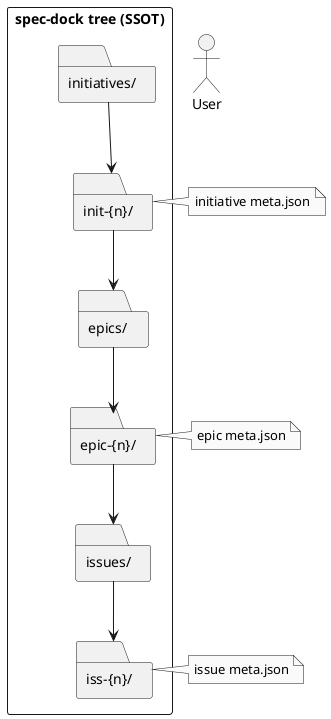
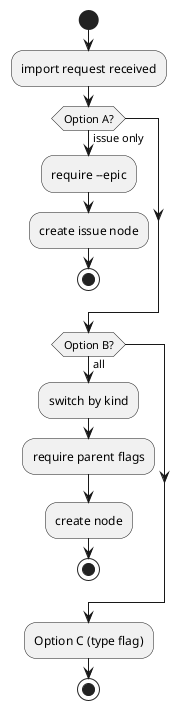

# adr-00001 Import 機能の最小単位（initiative/epic/issue）

## 結論（Decision） (必須)
- 採用: **Option B（initiative/epic/issue 全てを import 対象に含める）**
- 親子関係の指定:
  - `import issue` は **既存 epic を指定**（`--epic` または “現在の active” から解決。解決できない場合はエラー）
  - `import epic` は **既存 initiative を指定**（`--initiative` または “現在の active” から解決。解決できない場合はエラー）
  - `import initiative` は親指定なし
- 既存 branch の import はこの ADR のスコープ外（`adr-00004` で扱う）

## 背景（Context） (必須)
- spec-dock の SSOT は `spec-dock/initiatives/**/meta.json` であり、運用上は `initiative → epic → issue` のツリーで作業を分解する（`workflow-tree.md`）。
- 既存の GitHub Issue / 既存のブランチが既に存在するリポジトリへ spec-dock を導入した場合、「既存資産を spec-dock に取り込む（登録する）」手段が必要。
- 取り込みの対象（initiative/epic/issue のどこまで）を決めないと、コマンド設計やバリデーション、フォルダ配置、テスト方針が確定できない。

制約:
- import は “安全・単純” を最優先し、推測で親子関係を自動推定しない方向が基本（ただし最終決定は TBD）。
- spec-dock の on-disk 仕様（`meta.json` 形状 / ディレクトリ構造）と整合する必要がある。

### UML（任意） (任意)

## 選択肢（Options considered） (必須)

### Option A: import は **issue のみ**
- 概要:
  - `issue` の import を提供する。
  - 親（epic/initiative）は事前に spec-dock ツリー内に存在する前提（`--epic` 等で明示）。
- Pros:
  - 実装が最小で済む（既存のディレクトリ/テンプレ/`_write_meta` が再利用しやすい）
  - “親の自動推定” を避けられ、事故が少ない
  - `workflow-tree.md` の運用（必ずツリーで作業単位を持つ）と整合しやすい
- Cons:
  - 既存 Epic/Initiative が大量にある移行では、import が段階的になり手間がかかる
  - 既存を丸ごと取り込みたい要求に弱い

### Option B: import は **initiative/epic/issue 全て**
- 概要:
  - それぞれ import コマンドを提供する（`import initiative|epic|issue`）。
  - 親子の指定は必須（例: epic import は `--initiative`、issue import は `--epic`）。
- Pros:
  - 既存資産を体系的に移行できる
  - 以降の運用が spec-dock に揃いやすい
- Cons:
  - コマンド・テスト・ドキュメントが増える
  - “既存 GitHub Issue がどのレイヤーか” をどう指定するかが追加論点（type 指定が必要）

### Option C: import は “一つのコマンド” だが **type を引数で指定**
- 概要:
  - `import --type {initiative|epic|issue} ...` のように type を明示して 1コマンドにまとめる。
- Pros:
  - CLI は増えにくい
- Cons:
  - 使い勝手が落ちる（毎回 type 指定）
  - `new` と `import` の境界が曖昧になりやすい

### UML（任意） (任意)

## 判断理由（Rationale） (必須)
- 判断軸（例）:
  - 最小実装で価値が出るか（導入時の詰まりポイントを解消できるか）
  - 親子関係の事故を防げるか（推測を避けられるか）
  - 既存運用からの移行コスト（大量移行の手数）
  - ドキュメント/テストの維持コスト

## 影響（Consequences） (必須)
- Positive:
  - 既存資産の取り込み手段ができ、spec-dock 導入が容易になる
- Negative / Debt:
  - import が増えるほど “移行” の仕様（親子、命名、運用）を固定する必要があり、後戻りが難しくなる
- 影響範囲:
  - `spec-dock/scripts/spec-dock` の CLI とファイル生成ロジック
  - `spec-dock/docs/*` のワークフロー（導入・移行）
  - `tests/test_cli.py` の CLI テスト追加
- Follow-ups:
  - 親子関係の指定/推定（別 ADR）
  - 既存ブランチ import（別 ADR）

## 参考（References） (任意)
- `src/spec_dock/assets/spec_dock/docs/workflow-tree.md`
- `src/spec_dock/assets/spec_dock/scripts/spec-dock`（`_scan_nodes`, `_write_meta`, `_new_*`）
