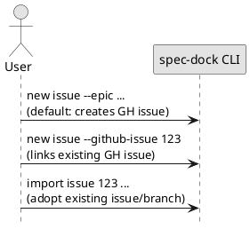
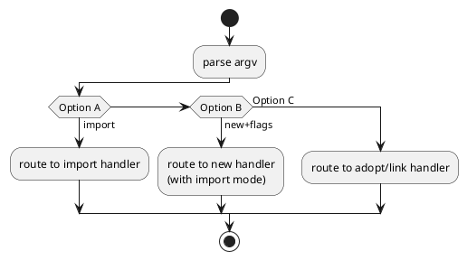

# adr-00002 Import 機能の CLI 形状（コマンド/引数）

## 結論（Decision） (必須)
- 採用: **Option A（`import` サブコマンドを追加する）**
  - 理由: `new` と責務を分離し、「新規作成」と「既存取り込み」を CLI 上で明確化するため。
  - 期待する形（概略）:
    - `spec-dock import initiative <num|url> --title <title> [--slug <slug>]`
    - `spec-dock import epic <num|url> --title <title> [--slug <slug>] [--initiative <initiative-id>]`
    - `spec-dock import issue <num|url> --title <title> [--slug <slug>] [--epic <epic-id>]`
  - 既存ブランチの import は今回のスコープ外（`--from-branch` 等は設けない）

## 背景（Context） (必須)
- 既存コマンド:
  - `new {initiative,epic,issue}`: spec-dock ノードを新規作成（デフォルトで GitHub Issue も作成）
  - `new ... --github-issue <num>`: “既存 GitHub Issue 番号に紐づけて” spec-dock ノードを新規作成
- import は “既存資産（Issue/branch）を spec-dock の SSOT に取り込む” ための機能であり、`new` と責務が混ざると運用が壊れやすい。
- 一方で、ユーザー体験としては「既存 Issue を登録する」が `new ... --github-issue` と似て見えるため、混乱しない CLI 設計が必要。

### UML（任意） (任意)

## 選択肢（Options considered） (必須)

### Option A: `import` サブコマンドを追加（推奨候補）
- 概要:
  - `spec-dock import issue <num|url> --epic <epic-id> [--from-branch <branch>] ...`
  - `import` は “移行/取り込み” のみを担当し、`new` と明確に分ける。
- Pros:
  - 意図が明確（`new`=新規作成、`import`=既存取り込み）
  - 後から “import の安全装置（dry-run 等）” を載せやすい
- Cons:
  - CLI が増える（学習コスト）

### Option B: 既存 `new` を拡張して import を内包
- 概要:
  - 例: `new issue --import --github-issue 123 --epic ...`
- Pros:
  - コマンド体系は増えない
- Cons:
  - `new` の責務が肥大化し、フラグ組み合わせが複雑化しやすい（事故要因）
  - “新規作成” と “取り込み” の副作用（gh 呼び出し/checkout/sync）を誤解しやすい

### Option C: `link` / `adopt` のような別名で追加
- 概要:
  - `spec-dock adopt issue ...`（言葉のニュアンスを調整）
- Pros:
  - `import` より「既存を取り込む」感が強い場合がある
- Cons:
  - 一般的には `import` の方が通じやすい

### UML（任意） (任意)

## 判断理由（Rationale） (必須)
- 判断軸（例）:
  - 誤操作のしにくさ（フラグ組み合わせ爆発を避けられるか）
  - 既存の `workflow-*` ドキュメントとの整合
  - 将来の拡張（dry-run / batch import / report 出力など）余地

## 影響（Consequences） (必須)
- Positive:
  - 既存資産の導入が CLI 上で明確化される
- Negative / Debt:
  - `import` の仕様が曖昧だと `new` と二重系になる（ドキュメント/サポート負荷）
- 影響範囲:
  - `src/spec_dock/assets/spec_dock/scripts/spec-dock` の argparse サブコマンド追加
  - `src/spec_dock/assets/spec_dock/docs/*` の移行手順追記
  - `tests/test_cli.py` の新テスト追加（スタブ gh / git をどう扱うか）

## 参考（References） (任意)
- `src/spec_dock/assets/spec_dock/docs/workflow-issue.md`（active 入口）
- `src/spec_dock/assets/spec_dock/docs/workflow-tree.md`（ツリー運用）
- `src/spec_dock/assets/spec_dock/scripts/spec-dock`（argparse 構造）
