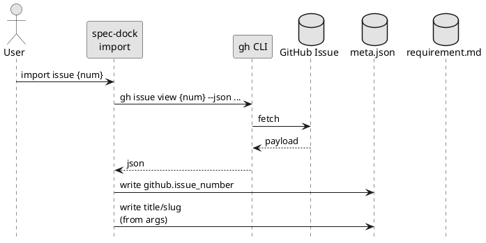
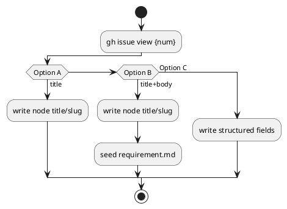

# adr-00003 GitHub Issue から取り込むデータ範囲（title/body/labels 等）

## 結論（Decision） (必須)
- 採用: **必要最小限（GitHub Issue 本文/管理情報は取り込まない）**
  - import 時に GitHub Issue の本文（body）は spec-dock の要件定義へ自動転記しない
    - 理由: 要件定義書のフォームと GitHub Issue の記述形式が一致しない可能性が高いため
  - spec-dock 側へ永続保存する GitHub 情報は最小限に留める（`meta.json` の `github.issue_number`）
  - GitHub Issue の title は import 時の node `title` としては利用しない（日本語 title の可能性があるため）
    - node の `title` は **ユーザーが import 引数として明示指定**する
  - `labels/milestone/assignees` 等の管理情報は取り込まない
  - `gh issue view` が失敗した場合は **エラーで中断**する（取り込みを続行しない）

## 背景（Context） (必須)
- 現状の spec-dock は `new` 実行時に `gh issue create` を呼び、戻りの URL から issue 番号だけを採用する。
- `--github-issue <num>` は “番号だけ紐づけ” であり、GitHub 側の title/body を取り込まない（ユーザーが `--title` を別途入力する前提）。
- import を追加するなら、「取り込まれる情報」と「取り込まれない情報」を明確にしないと運用がブレる。

保存先候補:
- `meta.json`（最小の durable メタ）
- `requirement.md`（Issue 仕様として読むべき情報）
- `.agent/index.json` などの派生（ただし派生は SSOT ではない）

### UML（任意） (任意)

## 選択肢（Options considered） (必須)

### Option A: GitHub からは “存在確認のみ”（title はユーザー指定）
- 概要:
  - `gh issue view` は “Issue が参照可能か” の確認としてのみ実行する（失敗したら中断）。
  - node の `title/slug` はユーザー入力を採用する（GitHub title は参照しない）。
  - `meta.json` には `github.issue_number` と `title/slug`（spec-dock 側の正）を保存する。
- Pros:
  - シンプル（情報量が少なく破綻しにくい）
  - GitHub title が日本語でも、spec-dock 側の命名規約を維持できる
  - “読み物（requirement/design）” は spec-dock 側の運用に寄せられる
- Cons:
  - GitHub 側の title/body/背景が spec-dock に来ない（導入時の手間）

### Option B: title + body を取り込む（requirement.md に転記）
- 概要:
  - `gh issue view` で body も取得し、`requirement.md` の “背景/現状” セクションへ初期値として埋める（あるいは References に貼る）。
- Pros:
  - 既存 Issue のコンテキストを移せる
- Cons:
  - body のフォーマット（Markdown）や量が大きく、ノイズになり得る
  - PII/機密が混ざるリスク（import 時点でリポジトリへ保存される）

### Option C: title + labels/milestone/assignees まで取り込む（構造化）
- 概要:
  - GitHub の管理情報を `meta.json` か派生ファイルへ保存する（例: `meta.json.github.*` を増やす/増やさないは要検討）。
- Pros:
  - トリアージやレポート用途に活用できる
- Cons:
  - spec-dock のメタスキーマが膨らむ（互換負債）
  - `sync --github` との責務分離が難しくなる

### UML（任意） (任意)

## 判断理由（Rationale） (必須)
- 判断軸（例）:
  - import 後に “spec-dock の仕様（requirement/design/plan）” へ自然に移行できるか
  - PII/機密の扱い（保存してよいか、マスキングが必要か）
  - GitHub と spec-dock の二重管理（どちらを正とするか）
  - 将来の `sync --github`（読み取り enrich）との重複を避けられるか

## 影響（Consequences） (必須)
- Positive:
  - 既存 Issue の取り込み時の初期情報が埋まり、導入が容易になる可能性
- Negative / Debt:
  - 取り込み範囲が増えるほど、スキーマ互換/運用/セキュリティの負債が増える
- 影響範囲:
  - `gh` 実行（`gh issue view`）のエラー設計
  - `meta.json` の設計（フィールド追加の可否）
  - 生成される markdown（requirement.md の初期値）

## 参考（References） (任意)
- `docs/github-issue-integration.md`（現行の gh 連携の整理）
- `src/spec_dock/assets/spec_dock/scripts/spec-dock`（`_gh_issue_create`, `_gh_issue_index`）
