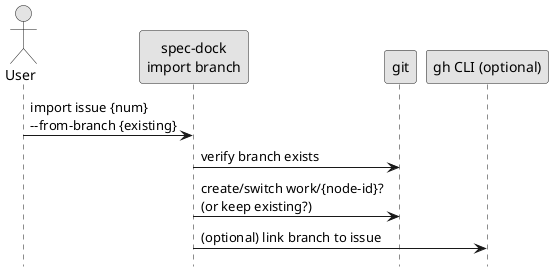
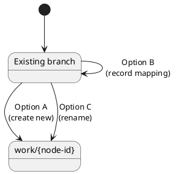

# adr-00004 既存ブランチの import（work ブランチ作成/リンク/rename の扱い）

## 結論（Decision） (必須)
- 決定: **既存ブランチの import は今回のスコープ外とし、実装しない**
  - 理由: 事故（既存運用/PR/CI/共有ブランチ）に与える影響が大きく、仕様の確定と安全装置の設計コストが高い。
  - 取り込み（import）は **spec-dock ツリー（meta.json + テンプレ）を作ることに限定**し、ブランチ操作（create/rename/checkout/link）は行わない。
  - Follow-up: 既存ブランチの移行導線が必要になったタイミングで、別スコープとして再検討する（必要なら新 ADR を起こす）。

## 背景（Context） (必須)
- spec-dock は node を `meta.json` で管理するが、「ブランチ名 ↔ node-id」の永続マッピングは持っていない。
- 一方、現実のリポジトリには既存ブランチ（規約外/日本語/legacy 命名など）が存在し得る。
- import で “既存ブランチから作業を継続できる状態” を作りたいが、何を自動化し、何を手動にするかを決めないと事故が起きる。

制約:
- 破壊的操作（履歴改変/強制更新など）は避ける（運用事故防止）。
- “単純化” 方針の下では、import は明示的な操作として提供し、推測で動かないのが望ましい。

### UML（任意） (任意)

## 選択肢（Options considered） (必須)

### Option A: 既存ブランチを “base” にして `work/{node-id}` を新規作成（非破壊）
- 概要:
  - `--from-branch <existing>` を受け取り、`work/{node-id}` をそのブランチを起点に作る（`git checkout -b` 相当）。
  - 既存ブランチは残す（rename しない）。
- Pros:
  - 既存ブランチを壊さない（安全）
  - spec-dock 側の “正” を `work/*` に寄せやすい
- Cons:
  - ブランチが増える（既存 + work）
  - “どちらが正か” の運用ルールが必要

### Option B: 既存ブランチ名を維持し、spec-dock が “この issue の作業ブランチ” を記録する
- 概要:
  - spec-dock 側に branch mapping（例: `.agent/branch-map.json`）のような SSOT/準SSOT を追加する。
- Pros:
  - ブランチを増やさず継続できる
- Cons:
  - 新しい永続データ設計が必要（互換/移行/破損耐性）
  - “ブランチ名が変わったらどうするか” 等の運用が難しい

### Option C: 既存ブランチを rename して `work/{node-id}` に寄せる
- 概要:
  - `git branch -m` 相当で rename する（必要なら remote も…だが危険）。
- Pros:
  - ブランチが増えない
  - 規約を強制できる
- Cons:
  - 事故りやすい（既存の共有/PR/CI/外部リンクが壊れる）
  - remote との整合が面倒（非推奨）

### UML（任意） (任意)

## 判断理由（Rationale） (必須)
- 判断軸（例）:
  - 安全性（既存運用/PR/CI を壊さない）
  - “spec-dock を正” に寄せられるか
  - 永続データ（branch mapping）を増やす覚悟があるか
  - 取り込み後の作業導線（active/sync との整合）

## 影響（Consequences） (必須)
- Positive:
  - 既存ブランチ運用から spec-dock への移行導線ができる
- Negative / Debt:
  - Option B を採ると SSOT が増え、将来の破損/互換負債が増える
- 影響範囲:
  - git 操作（安全装置、dry-run、エラー時の復帰）
  - 必要なら `gh` による linked branch 更新
  - ドキュメント（移行手順）

## 参考（References） (任意)
- `src/spec_dock/assets/spec_dock/scripts/spec-dock`（git 操作 / active / sync）
- `src/spec_dock/assets/spec_dock/docs/workflow-tree.md`
