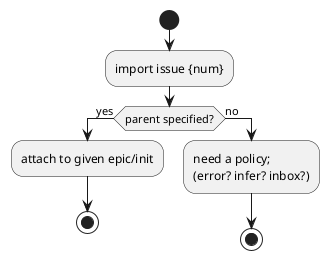
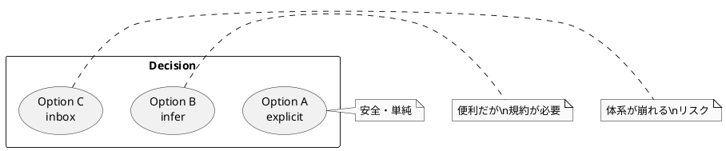

# adr-00005 Import 時の親子関係（epic/initiative）指定: 明示必須 vs 自動推定

## 結論（Decision） (必須)
- 決定: **Option A（親指定は原則必須）を採用しつつ、未指定時は “現在の active” から補完する**
  - `import issue`:
    - `--epic <epic-id>` が指定されていればそれを採用する
    - `--epic` が無い場合は **現在の active から epic を解決**する（active epic を優先、active issue の場合はその親 epic を採用）
    - それでも epic を解決できない場合は **エラー**（`--epic` の指定を要求）
  - `import epic`:
    - `--initiative <initiative-id>` が指定されていればそれを採用する
    - `--initiative` が無い場合は **現在の active から initiative を解決**する（active initiative を優先、active epic/issue の場合はその initiative を採用）
    - それでも initiative を解決できない場合は **エラー**（`--initiative` の指定を要求）
  - 理由:
    - 親子関係の推測（labels/milestone 等）は誤分類リスクが高いので避ける
    - 一方で毎回親を指定する UX を軽減するため、active による “安全な既定値” を許容する

## 背景（Context） (必須)
- spec-dock のツリー運用は `initiative → epic → issue` が前提で、Issue は必ず Epic に属する（`_validate_nodes` でも必須）。
- import は既存 GitHub Issue を取り込むが、GitHub 側の情報だけでは “どの Epic/Initiative に属すか” は必ずしも確定できない。
- 自動推定を入れると便利だが、誤分類は運用コストを増大させる（後から直すのが大変）。

### UML（任意） (任意)

## 選択肢（Options considered） (必須)

### Option A: 親指定は必須（推奨候補）
- 概要:
  - `import issue` は `--epic <id>` を必須とする（epic は既に登録済みの前提）。
  - `import epic` は `--initiative <id>` を必須とする。
- Pros:
  - 誤分類が起きない（事故を防ぐ）
  - 実装が単純（推測不要）
- Cons:
  - 初期導入時に手間が増える（大量 import の UX が弱い）

### Option B: GitHub 情報から自動推定（ラベル/マイルストーン等）
- 概要:
  - `gh issue view` で labels/milestone/project などを取り込み、それを規約に基づき parent へマッピングする。
- Pros:
  - 大量移行に向く（半自動化）
- Cons:
  - 組織/リポジトリごとに規約が違い、汎用実装が難しい
  - ルールが壊れると誤分類が発生する

### Option C: “inbox” のような一時置き場を用意（後で分類）
- 概要:
  - 親が未指定の Issue を `spec-dock/inbox/` のような別レイヤーに保持し、後で移動して確定する。
- Pros:
  - import を止めずに進められる
- Cons:
  - spec-dock のツリー前提（initiative/epic/issue）から逸脱し、全体が複雑になる
  - validate/active/sync への影響が大きい

### UML（任意） (任意)

## 判断理由（Rationale） (必須)
- 判断軸（例）:
  - “単純化” 方針に沿うか（推測を避けられるか）
  - 大量導入の現実（数十/数百 issue をどう移行するか）
  - 誤分類のコスト（後から直す作業量）

## 影響（Consequences） (必須)
- Positive:
  - 親子関係が固定され、validate/sync/active の整合が取りやすい
- Negative / Debt:
  - Option B/C を採ると運用ルールが増え、破綻点が増える
- 影響範囲:
  - import CLI の引数必須化
  - ドキュメント（移行手順、規約）
  - テスト（親指定無しケースの扱い）

## 参考（References） (任意)
- `src/spec_dock/assets/spec_dock/scripts/spec-dock`（`_validate_nodes`、親ID必須）
- `src/spec_dock/assets/spec_dock/docs/workflow-tree.md`
