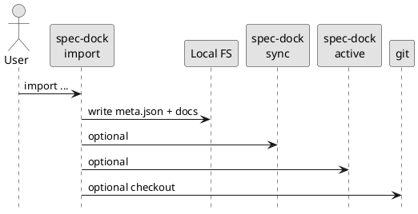
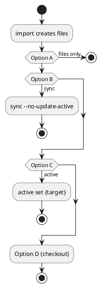

# adr-00006 Import 実行後の副作用範囲（sync/active/checkout）

## 結論（Decision） (必須)
- 決定: **Option B（import 後に sync まで実行。ただし active は触らない）**
  - import の実行範囲:
    - spec-dock ツリー（templates + meta.json）を作成する
    - 続けて `sync` を実行して、派生状態（`spec-dock/.agent/index.json` / `tree.json`）を更新する
  - active の扱い:
    - import は `active set` を実行しない
    - `sync` 実行時も active を更新しない（`--no-update-active` 相当）
  - checkout の扱い:
    - import はブランチの checkout を行わない（ブランチ操作はスコープ外）

## 背景（Context） (必須)
- spec-dock は `sync` により `.agent/index.json` / `.agent/tree.json` を生成し、必要なら “ブランチ名から active 推測” も行う（`update_active`）。
- `active set` は “ユーザーの明示操作” として active を更新し、`context-pack.md` を生成する。
- import は “移行/取り込み” であり、勝手に active を変えるとユーザーの作業コンテキストを壊す可能性がある。

### UML（任意） (任意)

## 選択肢（Options considered） (必須)

### Option A: import は “ファイル作成のみ”（副作用最小）
- 概要:
  - spec-dock ツリー（templates + meta.json）を作成するだけ。
  - `sync` / `active` / `checkout` は一切しない。
- Pros:
  - 予測可能で安全（ユーザーの現在状態を壊しにくい）
  - 実装が単純
- Cons:
  - 直後に `sync` や `active set` を手動で行う必要がある（手数）

### Option B: import 後に `sync` まで実行（active は触らない）
- 概要:
  - import 後に `sync --no-update-active` 相当で派生状態を更新する。
- Pros:
  - index/tree が即更新され、ツール利用が滑らか
  - active を勝手に変えない
- Cons:
  - `sync` が重い/失敗する環境では import が失敗扱いになる（扱い要設計）

### Option C: import 後に `active set`（もしくは active を直接更新）
- 概要:
  - import した対象をそのまま “今の作業対象” にする。
- Pros:
  - 1コマンドで作業開始まで行ける
- Cons:
  - 既存の active を上書きする（驚きが大きい）
  - 失敗時の復旧が難しい

### Option D: import 後に checkout まで行う（git/gh 操作を含む）
- 概要:
  - `--from-branch` などがある場合、work ブランチへ切り替える/作る。
- Pros:
  - 既存ブランチからの移行が滑らか
- Cons:
  - git 副作用が大きい（dirty tree 保護、失敗時復帰、CI 影響などが必要）

### UML（任意） (任意)

## 判断理由（Rationale） (必須)
- 判断軸（例）:
  - 安全性（ユーザーの作業中ブランチ/active を壊さない）
  - 失敗時の復旧容易性（ロールバック可能か）
  - UX（導入/移行の手数）

## 影響（Consequences） (必須)
- Positive:
  - import の導入体験を “安全” と “便利” のどちらに寄せるかが固定できる
- Negative / Debt:
  - 副作用を増やすほど復旧ロジックが必要になり複雑化する（今回の反省点）
- 影響範囲:
  - `sync` の呼び方（`update_active` の扱い）
  - `active` の更新の責務（明示操作と自動の境界）
  - git 操作（dirty tree、復帰、エラー設計）

## 参考（References） (任意)
- `src/spec_dock/assets/spec_dock/scripts/spec-dock`（`_sync`, `_active_set`）
- `src/spec_dock/assets/spec_dock/docs/workflow-issue.md`
