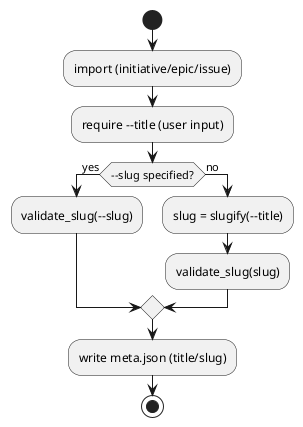

# adr-00007 Import の title/slug 命名規約（ASCII 強制の有無）

## 結論（Decision） (必須)
- 決定: **Option A（現行の slug 制約を維持。ASCII 強制はしない）**
  - import は `--title` を必須とする（GitHub title は採用しない）。
  - `--slug` 未指定時は `--title` から既存の `slugify` ロジックで導出し、既存の `slug` バリデーションに従う。
  - ASCII のみを要求する追加バリデーションは入れない（必要なら `--slug` を明示して運用する）。

## 背景（Context） (必須)
- import は「既存 GitHub Issue を spec-dock の SSOT（meta.json）へ登録する」ための導入/移行機能である。
- `slug` はディレクトリ名の一部として永続化されるため、制約を強くすると互換性と移行の手間に直結する。
- 現行の spec-dock では `slug` に対し「小文字・区切りなし・`isalnum` と `-_.` を許容（Unicode 可）」というルールを採用している。
- 一方で、GitHub Issue の title は日本語である可能性があり、GitHub title をそのまま採用すると意図しない命名になる可能性がある。

### UML（任意） (任意)

## 選択肢（Options considered） (必須)

### Option A: 現行の slug 制約を維持（Unicode 可）
- Pros:
  - 既存仕様・既存データとの整合が保てる
  - import の導入障壁が増えない
- Cons:
  - `--title` に日本語を指定すると `slug` が日本語になる可能性がある（運用で回避が必要）

### Option B: import に限り ASCII slug を必須にする
- Pros:
  - パスが ASCII で安定しやすい
- Cons:
  - 既存の slug 仕様と不整合になりやすく、移行コストが増える
  - 既に Unicode slug を許容している運用では破壊的になり得る

## 判断理由（Rationale） (必須)
- import は移行導線であり、追加制約による失敗が増えると導入が止まりやすい。
- ASCII を必要とする場合は `--slug` を明示する運用で吸収できる。

## 影響（Consequences） (必須)
- Positive:
  - 現行の slug 仕様との互換を維持できる
  - import の UX を悪化させない
- Negative / Debt:
  - 日本語 `slug` を避けたい場合は運用（`--slug` 明示）で統制が必要

## 参考（References） (任意)
- `src/spec_dock/assets/spec_dock/scripts/spec-dock`（`_slugify`, `_validate_slug`）
- `tmp/issue-import/requirement.md`（Q-001）
