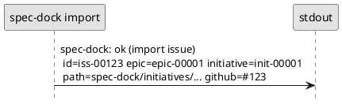

# adr-00008 Import の成功メッセージ（出力フォーマット）

## 結論（Decision） (必須)
- 決定: **Option A（生成した node id / 親 id / path を必ず出力する）**
  - import 成功時は、少なくとも以下を 1 行で出力する:
    - 生成した node の `id`
    - 親（initiative/epic）の `id`（該当する場合）
    - 生成された node ディレクトリの `path`（repo root からの相対）
    - `github.issue_number`（入力の Issue 番号）

## 背景（Context） (必須)
- spec-dock はファイル生成（テンプレ + meta.json）を行うツールであり、成功時に「何がどこに作られたか」が分からないと次の作業（レビュー、sync、active set）が滞る。
- 既存の `new` サブコマンドは成功時に `id` と `path`（および親 id）を出力しており、import も同水準の観測性が必要。

### UML（任意） (任意)

## 選択肢（Options considered） (必須)

### Option A: id / 親 id / path を必ず出す（採用）
- Pros:
  - 手動テスト/レビュー時に観測が容易
  - 後続の操作（ファイル確認、grep、sync、PR作成）がしやすい
- Cons:
  - 出力が長くなる

### Option B: 最小（id のみ）
- Pros:
  - 出力が短い
- Cons:
  - 生成場所の特定に追加作業が必要（導入時のストレスが増える）

## 判断理由（Rationale） (必須)
- import は導入フェーズでの利用が多く、初回から「観測できる」ことが重要。
- `new` と出力の粒度を揃えることで混乱を減らせる。

## 影響（Consequences） (必須)
- Positive:
  - 取り込み結果の確認が容易になる
- Negative / Debt:
  - 将来的に機械可読な出力（JSON 等）が必要になった場合は別途検討が必要

## 参考（References） (任意)
- `src/spec_dock/assets/spec_dock/scripts/spec-dock`（`_new_initiative/_new_epic/_new_issue` の成功メッセージ）
- `tmp/issue-import/requirement.md`（Q-002）
