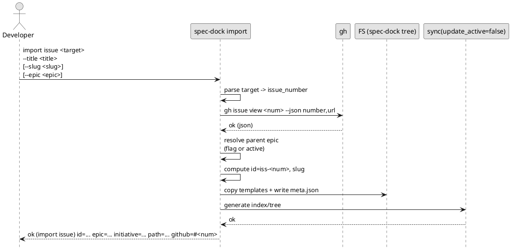
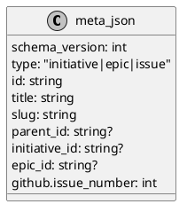
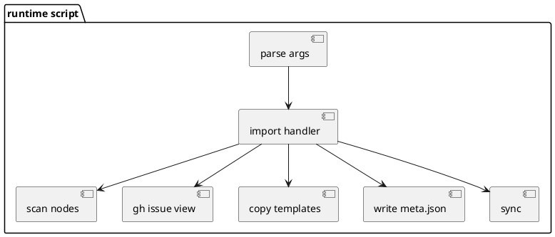

# iss-import-00001 Import: 既存 GitHub Issue を spec-dock ツリーへ取り込む（initiative/epic/issue） — 設計（HOW）

## 目的・制約（要件から転記・圧縮） (必須)
- 目的:
  - 既存 GitHub Issue を spec-dock の SSOT（`meta.json`）へ initiative/epic/issue として登録できるようにする。
  - 取り込み後に `sync --no-update-active` 相当まで実行し、派生（index/tree）を更新する。
- MUST:
  - `import` サブコマンドを追加する（`new` と責務分離）。
  - 入力は `123` / `#123` / URL（`.../issues/123`）を受理し、URL は番号抽出のみ（別 repo は対象外）。
  - `--title` は必須（GitHub title は採用しない）。
  - `gh issue view` で存在確認し、失敗時はローカルを一切生成しない。
  - 親は `--epic`/`--initiative`、未指定時は active から補完（解決できなければエラー）。
  - 成功時に `id/親id/path/github` を必ず出力する。
- MUST NOT:
  - import で GitHub Issue 作成/編集をしない（body/labels 取り込みなし）。
  - import で checkout/branch 操作をしない。
  - import で active を変更しない。
- 非交渉制約:
  - 既存の on-disk 仕様（テンプレ/構造/`meta.json`/slug 制約）に整合させる。
  - `gh` は非対話前提、失敗は明確なエラー。
- 前提:
  - spec-dock が初期化済みで `spec-dock/` がある。
  - `gh issue view` が実行できる。

---

## 既存実装/規約の調査結果（As-Is / 99.9%理解） (必須)
- 参照した規約/実装（根拠）:
  - `src/spec_dock/assets/spec_dock/scripts/spec-dock`: runtime の SSOT/テンプレ生成/gh 呼び出し/active/sync を規定しているため
  - `src/spec_dock/assets/spec_dock/docs/workflow-tree.md`: initiative→epic→issue のツリー前提のため
  - `tmp/issue-import/requirement.md`: 本 Issue の承認済み要件のため
  - `tmp/issue-import/adrs/*.md`: 決定事項（D-001〜D-008）の根拠のため
- 観測した現状（事実）:
  - SSOT は `_scan_nodes()` が `spec-dock/initiatives/**/meta.json` を走査して id→node を構築する。
  - ノード生成は `_copy_template_tree()` + `_write_meta()` のパターンで行われ、`new` 系がこれを踏襲している。
  - `sync` は `_sync(..., update_active=...)` が index/tree を生成し、`update_active=True` の場合のみブランチ名から active 推測を試みる。
  - `gh` は `_ensure_gh_available()` を通して存在チェックし、`subprocess.run(..., check=True)` で失敗を例外化する方針。
  - 親IDの入力は `_resolve_id_input()` が `NNNN / <prefix>-NNNN / <prefix>-local-NNNN` を受け取り、曖昧ならエラーにする。
- 採用するパターン:
  - import も `new` と同様に「テンプレ複製→meta.json 生成→成功メッセージ」パターンを踏襲する。
  - 例外は `RuntimeError` を投げ、`main()` で `error: ...` へ集約する。
- 採用しない/変更しない:
  - `new ... --github-issue` の位置づけ変更は今回しない（要件の OUT OF SCOPE）。
  - validate の `github.issue_number` 重複検出追加は今回しない（要件の OUT OF SCOPE）。
- 影響範囲:
  - runtime CLI: `spec-dock/scripts/spec-dock`（argparse と import ハンドラ追加）
  - テスト: `tests/test_cli.py`（gh スタブで import の AC/EC を担保）
  - ドキュメント: 将来的に `spec-dock/docs/github.md` 等へ追記候補（本ブランチの temp docs で先に固める）

## 主要フロー（テキスト：AC単位で短く） (任意)
- Flow for AC-001（import issue）:
  1) `target` から issue_number を抽出（`123/#123/URL` は同一扱い）
  2) `gh issue view <num> --json number,url` が成功することを確認（失敗なら即中断）
  3) 親 epic を `--epic` または active から解決（曖昧/不正ならエラー）
  4) `iss-<num>` の id を決定し、テンプレを epic 配下へ生成、`meta.json` に `github.issue_number=<num>` を保存
  5) `sync --no-update-active` 相当を実行（update_active=False）
  6) 成功メッセージ（id/親id/path/github）を出して終了
- Flow for AC-002（import epic/initiative）:
  - epic: 親 initiative を `--initiative` または active から解決し、`epic-<num>` を initiative 配下へ生成
  - initiative: 親なしで `init-<num>` を initiatives 直下へ生成
- Flow for AC-003（gh issue view 失敗）:
  1) `gh issue view` が失敗したら、テンプレ/meta.json/index/tree を一切作らずに非 0 で終了

### UML（任意） (任意)


## データ・バリデーション（必要最小限） (任意)
- MODEL-001: import 入力（CLI）
  - Fields:
    - `kind`: `initiative|epic|issue`
    - `target`: `123 | #123 | https://.../issues/123`
    - `title`: 必須（GitHub title は使わない）
    - `slug`: 任意（未指定は slugify）
    - 親: `--initiative` / `--epic`（任意。未指定は active から補完）
  - Validation:
    - `target` は GitHub issue_number に解決できること（node id は受理しない）
    - `title` は必須
    - `slug` は既存の `_validate_slug` で検証
    - 親フラグは `_resolve_id_input` で解決（曖昧ならエラー）
- MODEL-002: 生成される SSOT（meta.json）
  - Fields:
    - `type/id/title/slug/parent_id/initiative_id/epic_id`
    - `github.issue_number`（必須: target の番号）
  - Constraints:
    - `github.issue_number` は initiative/epic/issue 全体で一意（既にリンク済みならエラー）

### UML（任意） (任意)


## 判断材料/トレードオフ（Decision / Trade-offs） (任意)
- 論点: URL 入力の扱い（owner/repo を解釈するか）
  - 決定: URL は番号抽出のみ、repo 解決は gh に委譲（別 repo は対象外）
  - 理由: クロス repo はスキーマ拡張と安全装置が必要で別 ADR 案件のため
- 論点: 親指定の手数 vs 安全性
  - 決定: 原則は明示、未指定時のみ active から補完
  - 理由: 推測は避けつつ日常運用の手数を抑えるため

## インターフェース契約（ここで固定） (任意)
### API（ある場合）
- なし（CLI ツールのため）

### 関数・クラス境界（重要なものだけ）
- IF-001: `spec-dock/scripts/spec-dock::_parse_args(argv: list[str]) -> argparse.Namespace`
  - 変更: `import` サブコマンド（initiative/epic/issue）を追加する
- IF-002: `spec-dock/scripts/spec-dock::_import_initiative(specdock_dir: Path, *, issue_number: int, title: str, slug: str | None) -> None`
- IF-003: `spec-dock/scripts/spec-dock::_import_epic(specdock_dir: Path, *, issue_number: int, title: str, slug: str | None, initiative_id: str | None) -> None`
- IF-004: `spec-dock/scripts/spec-dock::_import_issue(specdock_dir: Path, *, issue_number: int, title: str, slug: str | None, epic_id: str | None) -> None`
- IF-005: `spec-dock/scripts/spec-dock::_gh_issue_view_minimal(repo_root: Path, *, issue_number: int) -> dict[str, Any]`
  - 目的: `gh issue view` の存在確認（title/body は取り込まない）
- IF-006: `spec-dock/scripts/spec-dock::_parse_github_issue_target(target: str) -> int`
  - 目的: `123/#123/URL` を issue_number へ正規化（node id は拒否）
- IF-007: `spec-dock/scripts/spec-dock::_resolve_parent_from_active(...) -> str`
  - 目的: 親未指定時の active 補完（stale/破損はエラー）

### UML（任意） (任意)


### クラス/インターフェース詳細設計（主要なもの） (任意)
> この Issue を “単独の作業単位” として完結させるために、必要な範囲だけ詳細化する。

- なし（既存の runtime script は単一ファイルの関数分割で完結させる）

### 例外/エラー契約（重要なものだけ） (任意)
- ERR-001: `gh issue view` 失敗
  - 発生条件: `gh issue view <num>` が非 0
  - 返し方: `RuntimeError("gh failed: ...")` → `main` が `error: ...` を出して exit 1
  - 重要: FS を生成しない（gh 成功確認後にのみ生成処理へ入る）
- ERR-002: 親が解決できない/曖昧/不正
  - 発生条件: `--epic/--initiative` 未指定かつ active 補完不可、または `_resolve_id_input` が曖昧
  - 返し方: `RuntimeError(...)`（明示指定を促す）
- ERR-003: github.issue_number が既にリンク済み
  - 発生条件: 既存ノードが `github.issue_number=<num>` を保持
  - 返し方: `RuntimeError(...)`（既存 node を示す）
- ERR-004: slug が不正 / slugify が空
  - 発生条件:
    - `--slug` が `_validate_slug` を満たさない
    - `--slug` 未指定で `slugify(--title)` が空（`--title` が特殊文字のみ等）
  - 返し方: `RuntimeError(...)`（`--slug` 明示を促す）
  - 重要: **テンプレ生成前に** slug を確定・検証して落とす（部分生成を避ける）
- ERR-005: sync 失敗（preflight validate failed 等）
  - 発生条件: import 後の `_sync(update_active=False)` が `RuntimeError` を投げる
  - 返し方: `RuntimeError(...)`（`main` が `error: ...` を出して exit 1）
  - 副作用: **テンプレ/meta.json は生成済み**であり、派生（index/tree）が更新されない可能性がある（ロールバックは OUT OF SCOPE）

## 変更計画（ファイルパス単位） (必須)
- 追加（Add）:
  - なし（runtime script 内に関数追加）
- 変更（Modify）:
  - `src/spec_dock/assets/spec_dock/scripts/spec-dock`: `import` CLI と import 実装（initiative/epic/issue）を追加
  - `tests/test_cli.py`: import の AC/EC を gh スタブでテスト追加
  - `src/spec_dock/assets/spec_dock/docs/github.md`（任意）: import 手順の追記（後続作業）
- 削除（Delete）:
  - なし
- 移動/リネーム（Move/Rename）:
  - なし
- 参照（Read only / context）:
  - `tmp/issue-import/requirement.md`: 要件の根拠
  - `tmp/issue-import/adrs/*.md`: 決定事項の根拠

## マッピング（要件 → 設計） (必須)
- AC-001（import issue） → IF-004 + IF-005 + `_copy_template_tree/_write_meta` + `_sync(update_active=False)`
- AC-002（import epic/initiative） → IF-002/IF-003 + IF-005 + テンプレ生成
- AC-003（gh 失敗で非汚染） → IF-005（gh を先に実行） + import 実装の順序保証
- AC-004（123/#/URL 同一） → IF-006（target 正規化）
- EC-001/EC-006（親解決失敗） → IF-007（active 補完のエラー契約）
- EC-002（親IDが存在しない/種別不正） → IF-007（親解決） + nodes 参照による種別チェック（epic/initiative）
- EC-003（github.issue_number 既リンク） → `_scan_nodes` + 既存リンク検出（import 前に衝突チェック）
- 非交渉制約（副作用最小） → import 内で git/active を触らない・sync は update_active=False

## テスト戦略（最低限ここまで具体化） (任意)
- 追加/更新するテスト:
  - Integration（runtime script 相当）:
    - `tests/test_cli.py` に `import` の新テストを追加（temp repo + gh bash stub）
- どのAC/ECをどのテストで保証するか:
  - AC-001 → `tests/test_cli.py` の `TestCli.test_import_issue_creates_node_and_runs_sync_without_updating_active`
  - AC-002 → `tests/test_cli.py` の `TestCli.test_import_epic_and_initiative_create_nodes`
  - AC-003 → `tests/test_cli.py` の `TestCli.test_import_aborts_without_local_changes_when_gh_issue_view_fails`
  - AC-004 → `tests/test_cli.py` の `TestCli.test_import_accepts_number_hash_and_url_equivalently`
  - EC-001 → `tests/test_cli.py` の `TestCli.test_import_issue_requires_parent_when_no_epic_and_active_unavailable`
  - EC-002 → `tests/test_cli.py` の `TestCli.test_import_rejects_invalid_or_wrong_type_parent_id`
  - EC-003 → `tests/test_cli.py` の `TestCli.test_import_rejects_already_linked_github_issue_number`
  - EC-004 → `tests/test_cli.py` の `TestCli.test_import_rejects_invalid_slug_and_empty_slugify`
  - EC-005 → `tests/test_cli.py` の `TestCli.test_import_fails_when_sync_preflight_fails`
  - EC-006 → `tests/test_cli.py` の `TestCli.test_import_parent_fallback_errors_on_stale_active`

### テストマトリクス（AC/EC → テスト） (任意)
- AC-001:
  - Integration:
    - `import issue` が node を生成し、`sync(update_active=false)` により `.agent/index.json/tree.json` が生成される
    - SSOT の `spec-dock/.agent/active.json` が更新されない（存在する場合は内容不変、存在しない場合は作られない）
- AC-003:
  - Integration:
    - `gh issue view` が失敗したら、テンプレ/meta.json/index/tree を一切作らない（ローカル非汚染）
- EC-001:
  - Integration:
    - `import issue` で `--epic` 未指定かつ active 補完もできない場合に、必ずエラーで落ちる
- EC-002:
  - Integration:
    - 親IDが存在しない/種別不正の場合に、必ずエラーで落ちる（誤った場所に生成しない）
- EC-003:
  - Integration:
    - `github.issue_number` が既に別ノードにリンク済みの場合に、必ずエラーで落ちる（重複リンクを作らない）
- EC-004:
  - Integration:
    - `--slug` 不正 → import 失敗、ローカル非汚染（gh 成功後でもテンプレ生成前に落ちる）
    - `slugify(--title)` が空 → import 失敗、`--slug` 明示を促す
- EC-005:
  - Integration:
    - 既存ツリーが壊れて `sync` が preflight validate failed で落ちた場合、import も失敗する（ロールバックしない）
- 非交渉制約（requirement.md）をどう検証するか:
  - 制約: `gh issue view` 以外の `gh` を呼ばない
    - 検証方法: `gh` スタブを用意し、`issue view` 以外の呼び出しは即 `exit 1` にする（誤呼び出しでテストが落ちる）
  - 制約: active を更新しない（SSOT の `spec-dock/.agent/active.json` を作らない/変更しない）
    - 検証方法:
      - `spec-dock/.agent/active.json` が無い状態で import し、`spec-dock/.agent/active.json` が生成されないことを確認
      - `spec-dock/.agent/active.json` がある状態で import し、内容が変化しないことを確認
      - 補足: `sync` は `spec-dock/active/*` のポインタ（symlink/pathfile）を更新し得るが、これは SSOT ではない（本制約は `.agent/active.json` の不変を指す）
  - 制約: sync は `update_active=False` で実行する
    - 検証方法:
      - ブランチ名に id が含まれる状態でも active が変化しないことを確認（update_active=True なら変わり得る条件を作る）
  - 制約: `gh issue view` 失敗時に `.agent/index.json/tree.json` を作らない
    - 検証方法: `gh issue view` を失敗させ、`.agent/index.json` / `.agent/tree.json` が存在しないことを確認
- 実行コマンド（該当するものを記載）:
  - `python -B -m unittest -v tests/test_cli.py`
- 変更後の運用（必要なら）:
  - 移行手順:
    1) `spec-dock/scripts/spec-dock import ...` を実行
    2) 出力された `path` を確認し、生成物（テンプレ/`meta.json`）をレビュー
    3) 必要なら `spec-dock/scripts/spec-dock active set <node-id>` で作業対象を切り替える（import は active を触らない）
  - ロールバック:
    - 自動ロールバックは行わない（必要なら生成ディレクトリを手動削除して戻す）
  - Feature flag:
    - なし

## リスク/懸念（Risks） (任意)
- R-001: `sync` が preflight validate failed で落ち、import が失敗する
  - 影響: テンプレ/meta.json は生成済みだが index/tree が更新されない可能性
  - 対応: ツリー修復後に `sync --no-update-active` を再実行（ロールバックは OUT OF SCOPE）
- R-002: active 補完が stale/破損で親解決できず、import が失敗する
  - 影響: `--epic/--initiative` 省略の UX が効かない
  - 対応: 親を明示指定して実行する（要件 EC-006）

## 未確定事項（TBD） (必須)
- なし

---

## ディレクトリ/ファイル構成図（変更点の見取り図） (任意)
```text
<repo-root>/
├── src/spec_dock/assets/spec_dock/scripts/spec-dock   # Modify: import CLI + handlers
├── tests/test_cli.py                                  # Modify: import tests
└── spec-dock/initiatives/                              # Output: imported nodes (generated at runtime)
```

## 省略/例外メモ (必須)
- 該当なし
