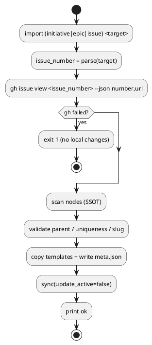

# iss-import-00001 Import: 既存 GitHub Issue を spec-dock ツリーへ取り込む（initiative/epic/issue） — 実装計画（TDD: Red → Green → Refactor）

## この計画で満たす要件ID (必須)
- 対象AC: AC-001 / AC-002 / AC-003 / AC-004
- 対象EC: EC-001 / EC-002 / EC-003 / EC-004 / EC-005 / EC-006
- 対象制約（非交渉）:
  - `gh` は `gh issue view` のみ呼ぶ（他の `gh` 呼び出しは禁止）
  - import は checkout / branch 操作をしない
  - import は SSOT の `spec-dock/.agent/active.json` を作らない/変更しない
  - import 後に `sync(update_active=false)` を実行し、`.agent/index.json` / `.agent/tree.json` を更新する
  - `gh issue view` 失敗時はテンプレ/meta.json/派生（index/tree）を一切生成しない

## ステップ一覧（観測可能な振る舞い） (必須)
- [x] S01: `import` 骨組み + `gh issue view` 失敗時にローカルを汚さず落ちる（AC-003）
- [x] S02: `import initiative` が SSOT を作り `sync(update_active=false)` まで実行し、active を変えない（AC-002）
- [x] S03: `import epic --initiative <id>` が正しい場所に生成され、親が不正なら落ちる（AC-002/EC-002）
- [x] S04: `import issue --epic <id>` が正しい場所に生成され、`sync(update_active=false)` まで実行する（AC-001）
- [x] S05: 入力 `123 / #123 / URL` を同一視して issue_number に正規化できる（AC-004）
- [x] S06: 親未指定時に active から親を補完して import できる（D-005）
- [x] S07: 親が解決できない/active が stale・破損の場合はエラーで落ちる（EC-001/EC-006）
- [x] S08: 親IDが存在しない/種別不正の場合はエラーで落ちる（EC-002）
- [x] S09: github.issue_number が既にリンク済みならエラーで落ちる（EC-003）
- [x] S10: slug 不正 / slugify 空はテンプレ生成前にエラーで落ちる（EC-004）
- [x] S11: sync が失敗したら import も失敗として返す（EC-005）

## 進行状況（実績） (必須)
- 完了日: `2026-02-13`
- 実装完了: `src/spec_dock/assets/spec_dock/scripts/spec-dock`（`import` CLI、`gh issue view` 検証、親解決、重複検出、`sync(update_active=false)`）
- テスト完了: `tests/test_cli.py`（`import` 系 14 テストを追加）
- 検証結果: `python -B -m unittest -v tests/test_cli.py` で `42 tests OK`

### UML（任意） (任意)

### 要件 ↔ ステップ対応表 (必須)
- AC-001 → S04
- AC-002 → S02, S03
- AC-003 → S01
- AC-004 → S05
- EC-001 → S07
- EC-002 → S03, S08
- EC-003 → S09
- EC-004 → S10
- EC-005 → S11
- EC-006 → S07
- 非交渉制約 → S01〜S11（各テストで継続的に検証）

---

## 実装ステップ（各ステップは“観測可能な振る舞い”を1つ） (必須)

> 進め方の原則:
> - **必ず Red → Green → Refactor** の順で進める。
> - 1ステップにつき「追加する振る舞い」は1つだけ（欲張らない）。
> - テストは `unittest`（`tests/test_cli.py` の `TestCli`）で増やし、`gh` は bash stub でネットワーク不要にする。
> - どのステップでも **`gh issue view` 以外の `gh` が呼ばれたらテストが落ちる** ように stub を作る（安全柵）。

### S01 — `import` 骨組み + `gh issue view` 失敗時に非汚染で落ちる（AC-003） (必須)
- 対象: AC-003
- 設計参照:
  - 対象IF: IF-001 / IF-005
  - 対象テスト: `tests/test_cli.py::TestCli.test_import_aborts_without_local_changes_when_gh_issue_view_fails`
- このステップで「追加しないこと（スコープ固定）」:
  - テンプレ生成・`meta.json` 生成・`sync` 実行（成功系は次ステップ）

#### Red（失敗するテストを先に書く）
- テストを追加:
  - `gh issue view` が常に失敗する stub を用意
  - `spec-dock ... import issue 99999 --title "X" --epic epic-local-00001` を実行して非0を期待
  - **確認**: `spec-dock/initiatives/**` が増えていない / `.agent/index.json` と `.agent/tree.json` が生成されていない

#### Green（最小実装）
- 変更予定ファイル:
  - Modify: `src/spec_dock/assets/spec_dock/scripts/spec-dock`
  - Modify: `tests/test_cli.py`
- 実装方針:
  - `import` サブコマンドを追加し、指定 kind に応じて handler を呼ぶ
  - handler 冒頭で `_gh_issue_view_minimal()` を呼び、失敗なら即エラー（以後の処理に入らない）

#### Refactor（振る舞い不変で整理）
- `gh` 呼び出し/エラー整形を `_gh_issue_view_minimal()` に集約

#### 品質ゲート
- `python -B -m unittest -v tests.test_cli.TestCli.test_import_aborts_without_local_changes_when_gh_issue_view_fails`

---

### S02 — `import initiative` が SSOT + sync を生成し、active を変えない（AC-002） (必須)
- 対象: AC-002（initiative パス）
- 設計参照:
  - 対象IF: IF-002 / IF-005
  - 対象テスト: `tests/test_cli.py::TestCli.test_import_epic_and_initiative_create_nodes`（このステップでは initiative のみ）
- このステップで「追加しないこと（スコープ固定）」:
  - epic/issue の import（S03/S04 で対応）

#### Red
- `import initiative 10 --title "Auth platform"` が成功し、以下を満たすテストを書く:
  - `meta.json` に `id=init-00010` と `github.issue_number=10`
  - `.agent/index.json` / `.agent/tree.json` が生成される
  - SSOT の `spec-dock/.agent/active.json` が作られない/変更されない
  - `gh` は `issue view` 以外が呼ばれない（stub の安全柵）

#### Green
- initiative のテンプレ生成 + `meta.json` 生成 + `sync(update_active=false)` 実行 + 成功メッセージ出力を実装
- `sync(update_active=false)` が破られたときに検知できるよう、テストでは git repo + ブランチ名（`feature/init-00010-test` 等）を用意し、active が生成されないことを確認する

#### Refactor
- 「id生成（0埋め）」の共通化（initiative/epic/issue で同じ規約を使う）

---

### S03 — `import epic --initiative <id>` が正しい場所に生成される（AC-002 / EC-002） (必須)
- 対象: AC-002（epic パス）、EC-002（親種別チェックの一部）
- 設計参照:
  - 対象IF: IF-003 / IF-005
  - 対象テスト: `tests/test_cli.py::TestCli.test_import_epic_and_initiative_create_nodes`（このステップで epic も追加）

#### Red
- `import epic 11 --title "JWT auth" --initiative init-00010` が成功し、epic が initiative 配下に生成されることをテスト
- `--initiative` に epic/issue を渡したらエラーになることをテスト（EC-002の一部）

#### Green
- `--initiative` を `_resolve_id_input()` で解決し、存在/種別を検証してから生成する

#### Refactor
- 親ID解決と「存在/種別」検証を helper へ（issue import でも再利用）

---

### S04 — `import issue --epic <id>` が正しい場所に生成され sync まで実行する（AC-001） (必須)
- 対象: AC-001
- 設計参照:
  - 対象IF: IF-004 / IF-005
  - 対象テスト: `tests/test_cli.py::TestCli.test_import_issue_creates_node_and_runs_sync_without_updating_active`

#### Red
- `new --no-github` で親 initiative/epic を作成 → `import issue 123 --title "Add refresh token" --epic epic-local-00001` が成功するテストを書く
- 観測点:
  - `iss-00123` の `meta.json` に `github.issue_number=123`
  - `.agent/index.json` / `.agent/tree.json` が生成される
  - `.agent/active.json` が変わらない（ブランチ名に `iss-00123` を含めても更新されない）

#### Green
- issue のテンプレ生成 + `meta.json` 生成 + `sync(update_active=false)` 実行 + 成功メッセージ出力を実装

#### Refactor
- initiative/epic/issue の「生成処理（テンプレ→meta→sync→出力）」の共通化（重複を整理）

---

### S05 — 入力 `123 / #123 / URL` を同一視できる（AC-004） (必須)
- 対象: AC-004
- 設計参照:
  - 対象IF: IF-006
  - 対象テスト: `tests/test_cli.py::TestCli.test_import_accepts_number_hash_and_url_equivalently`

#### Red
- 3つの target をそれぞれ別の一時リポジトリで import し、同じ `id=iss-00123` になることを確認するテストを書く

#### Green
- `_parse_github_issue_target()` を実装し、`123` / `#123` / `.../issues/123` を `123` に正規化する
- node id（例: `iss-00123`）そのものは **target として拒否**する（誤入力防止）

#### Refactor
- URL 抽出 regex を helper に閉じ込め、エラーメッセージを一貫させる

---

### S06 — 親未指定時に active から親を補完して import できる（D-005） (必須)
- 対象: D-005（要件の MUST: 親未指定時は active から補完）
- 設計参照:
  - 対象IF: IF-007
  - 対象テスト: （新規追加を推奨）
    - `tests/test_cli.py::TestCli.test_import_issue_uses_active_epic_when_parent_not_specified`
    - `tests/test_cli.py::TestCli.test_import_epic_uses_active_initiative_when_parent_not_specified`

#### Red
- `active set` で epic（または initiative）を設定した状態で、`--epic/--initiative` を省略して import が成功するテストを書く
- import 後に `.agent/active.json` が **不変**であることも合わせて確認する（読み取りは OK / 更新は NG）

#### Green
- `--epic/--initiative` 未指定時に `_resolve_parent_from_active()` で親を決定して生成する

#### Refactor
- parent fallback のロジックを 1 箇所に集約し、issue/epic の両方から呼べる形にする

---

### S07 — 親が解決できない/active が stale・破損ならエラーで落ちる（EC-001/EC-006） (必須)
- 対象: EC-001 / EC-006
- 設計参照:
  - 対象テスト:
    - `tests/test_cli.py::TestCli.test_import_issue_requires_parent_when_no_epic_and_active_unavailable`
    - `tests/test_cli.py::TestCli.test_import_parent_fallback_errors_on_stale_active`

#### Red
- active が無い（または親が含まれない）状態で `import issue ...` を実行すると必ずエラーになるテストを書く
- `.agent/active.json` が壊れている/指す先が無い/種別不正の状態を作り、必ずエラーになるテストを書く

#### Green
- EC-001/EC-006 の条件を判別して、親の明示指定（`--epic` / `--initiative`）を促すエラーにする

#### Refactor
- active の読み取りと検証（存在/種別）を helper に集約

---

### S08 — 親IDが存在しない/種別不正の場合はエラーで落ちる（EC-002） (必須)
- 対象: EC-002
- 設計参照:
  - 対象テスト: `tests/test_cli.py::TestCli.test_import_rejects_invalid_or_wrong_type_parent_id`

#### Red
- `--epic init-...` のような種別違い、存在しないID、曖昧な shorthand を渡した場合にエラーで落ちるテストを書く

#### Green
- `_scan_nodes()` の結果を使って「存在/種別」を厳密に検証する

#### Refactor
- 親検証 helper を `_import_epic/_import_issue` で共通利用

---

### S09 — github.issue_number が既にリンク済みならエラーで落ちる（EC-003） (必須)
- 対象: EC-003
- 設計参照:
  - 対象テスト: `tests/test_cli.py::TestCli.test_import_rejects_already_linked_github_issue_number`

#### Red
- 先に `new issue --github-issue 123`（または import 済み）を作った状態で `import issue 123 ...` がエラーになるテストを書く

#### Green
- import 前に `_scan_nodes()` で既存ノードを列挙し、`github.issue_number` の衝突を検出したら生成せずエラーにする

#### Refactor
- 衝突検出を helper 化し、initiative/epic/issue 共通で使う

---

### S10 — slug 不正 / slugify 空はテンプレ生成前にエラーで落ちる（EC-004） (必須)
- 対象: EC-004
- 設計参照:
  - 対象テスト: `tests/test_cli.py::TestCli.test_import_rejects_invalid_slug_and_empty_slugify`

#### Red
- `--slug Bad!Slug` がエラーになること、`--title` が特殊文字のみ等で slugify が空になった場合にエラーになることをテストする
- **重要**: いずれもテンプレ生成前に落ちること（ローカル非汚染）を確認する

#### Green
- slug の決定と `_validate_slug()` を **テンプレ生成前**に行う
- slugify が空の場合は `--slug` 明示を促す

#### Refactor
- 「slug 決定 → validate」を 1 関数に集約

---

### S11 — sync が失敗したら import も失敗として返す（EC-005） (必須)
- 対象: EC-005
- 設計参照:
  - 対象テスト: `tests/test_cli.py::TestCli.test_import_fails_when_sync_preflight_fails`

#### Red
- 既存ツリーを壊して `sync` が preflight validate failed になる状況を作り、import が非0で落ちるテストを書く

#### Green
- `_sync(update_active=false)` の失敗を import の失敗として扱い、エラーを表示して終了コードを非0にする

#### Refactor
- 例外の握り潰しを避け、`main()` によるエラー整形へ寄せる

---

## 未確定事項（TBD） (必須)
- なし

## 完了条件（Definition of Done） (必須)
- 対象AC/EC（AC-001〜AC-004、EC-001〜EC-006）がすべて満たされ、`unittest` で担保されている
- `gh issue view` 以外の `gh` 呼び出しが一切無い（stub により検知可能）
- import が `spec-dock/.agent/active.json` を作らない/変更しないことがテストで保証されている
- `sync(update_active=false)` が守られている（active が更新されないことがテストで保証されている）
- MUST NOT / OUT OF SCOPE（checkout/branch import など）を破っていない

## 省略/例外メモ (必須)
- 該当なし
