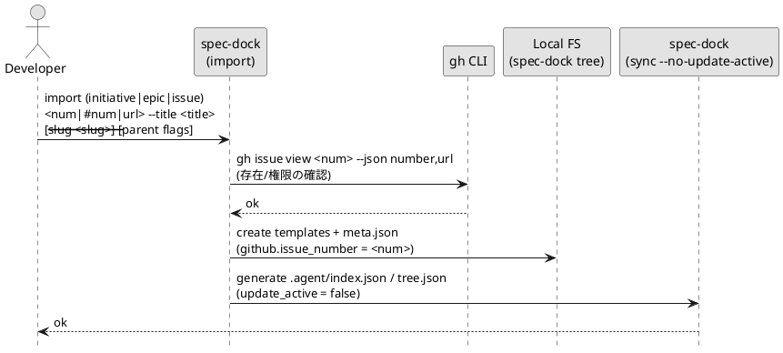

# iss-import-00001 Import: 既存 GitHub Issue を spec-dock ツリーへ取り込む（initiative/epic/issue） — 要件定義（WHAT / WHY）

## 目的（ユーザーに見える成果 / To-Be） (必須)
- 既に存在する GitHub Issue を、spec-dock の SSOT（`spec-dock/initiatives/**/meta.json`）に **initiative / epic / issue として登録（取り込み）**できる。
- 取り込みは **spec-dock のディレクトリ/テンプレ/`meta.json` を生成**し、取り込み後に `sync` を実行して派生状態（`.agent/index.json` / `tree.json`）まで更新できる。
- `new` と責務を分離した `import` コマンドにより、「新規作成」と「既存取り込み」を明確に区別できる。

## 背景・現状（As-Is / 調査メモ） (必須)
- 現状の挙動（事実）:
  - spec-dock の SSOT はローカルの `meta.json` であり、GitHub Issue の存在だけでは spec-dock のツリー（initiative→epic→issue）は成立しない。
  - 既存の GitHub Issue を取り込む導線が弱いと、spec-dock 導入時に「既存資産を spec-dock に登録できない」状態になる。
- 現状の課題（困っていること）:
  - `new` は（デフォルトで）GitHub Issue を新規作成する責務を持つため、「既存 Issue の取り込み」と混同しやすい。
  - GitHub Issue の title が日本語である可能性があり、取り込み時に GitHub title をそのまま spec-dock の `title` として採用すると、運用上望まない命名になる可能性がある。
- 再現手順（最小で）:
  1) 既に GitHub Issue（例: #123）が存在するリポジトリに spec-dock を導入する。
  2) spec-dock 側に initiative/epic/issue のどれかとして #123 を取り込みたいが、取り込み専用の明確な操作がない。
- 観測点（どこを見て確認するか）:
  - FS: `spec-dock/initiatives/**` の生成物（テンプレ、`meta.json`）が作られること
  - FS: `spec-dock/.agent/index.json` / `spec-dock/.agent/tree.json` が更新されること
  - CLI: `spec-dock/scripts/spec-dock import ...` の標準出力/標準エラーと終了コード
- 実際の観測結果（貼れる範囲で）:
  - Input/Operation: TBD（実装後に手動テストで埋める）
  - Output/State: TBD
- 情報源（ヒアリング/調査の根拠）:
  - ドキュメント:
    - `src/spec_dock/assets/spec_dock/docs/workflow-tree.md`（ツリー前提）
    - `src/spec_dock/assets/spec_dock/docs/workflow-issue.md`（active/sync の位置づけ）
  - コード:
    - `src/spec_dock/assets/spec_dock/scripts/spec-dock`（SSOT/テンプレ生成/`sync`/`active`）
  - ADR（議論ログ）:
    - `tmp/issue-import/adrs/adr-00001-import-scope.md`
    - `tmp/issue-import/adrs/adr-00002-import-cli-shape.md`
    - `tmp/issue-import/adrs/adr-00003-import-gh-data.md`
    - `tmp/issue-import/adrs/adr-00004-import-existing-branch.md`
    - `tmp/issue-import/adrs/adr-00005-import-parent-assignment.md`
    - `tmp/issue-import/adrs/adr-00006-import-side-effects.md`

## 対象ユーザー / 利用シナリオ (任意)
- 主な利用者（ロール）:
  - spec-dock を新規導入する開発者（既に GitHub Issue / ブランチ運用があるリポジトリ）
  - spec-dock 運用中に、ツール外で作られた GitHub Issue を後から spec-dock ツリーへ登録したい開発者
- 代表的なシナリオ:
  - 既存の GitHub Issue #123 を spec-dock の `issue` として取り込み、以後は spec-dock の要件/設計/計画テンプレの上で運用する。
  - 既存の GitHub Issue #10 を initiative として取り込み、その下に新しい epic/issue を spec-dock で追加していく。

### UML（任意） (任意)

## スコープ（暴走防止のガードレール） (必須)
- MUST（必ずやる）:
  - `spec-dock/scripts/spec-dock import` サブコマンドを追加する（`new` とは別系統）。
  - import 対象は **initiative / epic / issue** の 3 種。
  - 入力として GitHub Issue の **番号**（`123` / `#123`）または **URL**（`.../issues/123`）を受け付ける。
    - URL は **issue 番号の抽出にのみ使用**し、owner/repo の解釈（別リポジトリの Issue 参照）は行わない。
    - リポジトリ解決は `gh` に委譲し、import 対象は **現在のリポジトリの Issue** に限定する（別 repo は OUT OF SCOPE）。
  - node id は GitHub issue_number から決定する（0埋めは現行仕様に従う）:
    - initiative: `init-<issue_number>`
    - epic: `epic-<issue_number>`
    - issue: `iss-<issue_number>`
  - GitHub Issue の **存在確認**のために `gh issue view` を実行し、失敗したら import を中断する。
    - 失敗時は **テンプレ/meta.json/派生ファイル（index/tree）を一切生成しない**（ローカルを汚さない）。
  - spec-dock node の `title` は **ユーザーが `--title` で明示指定**する（GitHub title は採用しない）。
  - `slug` は `--slug` があればそれを採用し、無ければ `--title` から `slugify` で導出する（現行の slug 制約に従う）。
  - 取り込み時は spec-dock のテンプレをコピーし、`meta.json` を生成して SSOT へ登録する。
  - 取り込み後に `sync --no-update-active` 相当を実行し、`.agent/index.json` / `.agent/tree.json` を更新する（active は更新しない）。
  - import 成功時は、生成した node の **id / 親 id / path / github issue_number** を標準出力へ必ず出力する。
  - 親子指定:
    - 親指定フラグの受理形式は `new` と同等にする:
      - `--initiative`: `NNNN` / `init-NNNN` / `init-local-NNNN`
      - `--epic`: `NNNN` / `epic-NNNN` / `epic-local-NNNN`
      - 数値 shorthand が **曖昧**（同じ数値で local と GitHub の両方が存在）な場合は **エラー**として、完全な id 指定を要求する。
    - `import issue`:
      - `--epic <id>` 指定があればそれを採用する（解決できない/曖昧ならエラー）
      - `--epic` が無い場合は **現在の active から epic を解決**する（active epic を優先、active issue の場合はその親 epic を採用）
      - それでも epic を解決できない場合はエラー（`--epic` 指定を要求）
    - `import epic`:
      - `--initiative <id>` 指定があればそれを採用する（解決できない/曖昧ならエラー）
      - `--initiative` が無い場合は **現在の active から initiative を解決**する（active initiative を優先、active epic/issue の場合はその initiative を採用）
      - それでも initiative を解決できない場合はエラー（`--initiative` 指定を要求）
    - `import initiative` は親指定なし。
  - 同一 GitHub issue_number の多重リンク（複数 node が同一番号を持つ）を禁止し、既にリンク済みならエラーにする。
- MUST NOT（絶対にやらない／追加しない）:
  - GitHub Issue の新規作成（`gh issue create`）はしない。
  - GitHub Issue の本文（body）を spec-dock の要件定義書へ自動転記しない。
  - labels/milestone/assignees 等の管理情報を取り込まない。
  - import で node id を任意指定させない（`--id` 相当は設けず、GitHub issue_number から決定する）。
  - import 内で `active set` を実行しない（active を勝手に変えない）。
  - import 内で git checkout / branch rename / linked branch 操作などのブランチ操作をしない。
- OUT OF SCOPE:
  - 既存ブランチの import（既存ブランチを base に work ブランチを作る/rename する/linked branch へ登録する等）
  - URL から owner/repo を解釈し、別リポジトリの Issue を import する
  - GitHub 情報からの親子自動推定（ラベル/マイルストーン/プロジェクト等の規約ベース推定）
  - バッチ import（複数 issue をまとめて取り込む）
  - dry-run / rollback 等の高度な移行支援（必要になれば別スコープで検討）
  - `new ... --github-issue` の位置づけ変更（非推奨化/alias 化など）
  - validate で `github.issue_number` の重複検出を追加する（手編集・移行事故の早期検知）

## 境界（Always / Ask / Never） (必須)
- Always（常に守る）:
  - spec-dock の SSOT（`meta.json`）を正として扱い、import は SSOT を追加する操作であることを明確にする。
  - 取り込み対象の種類（initiative/epic/issue）はコマンドで明示し、推測しない。
- Ask（迷ったら相談）:
  - `sync` 失敗時にファイル生成をロールバックするかどうか。
- Never（絶対にしない）:
  - 既存ブランチ名の変更や、共有ブランチへの副作用を伴う操作を import の既定挙動として入れない。

## 非交渉制約（守るべき制約） (必須)
- 既存の on-disk 仕様（ディレクトリ構造 / `meta.json` 形状 / slug 制約）と整合すること。
- import は GitHub の副作用（Issue 作成/編集）や git の副作用（checkout/rename）を発生させないこと。
- `gh` 実行は非対話前提（`gh issue view` の失敗は明確にエラーとして扱う）。

## 前提（Assumptions） (必須)
- `spec-dock` が初期化済みであり、`spec-dock/templates/` と `spec-dock/initiatives/` が存在する。
- `gh` CLI が導入済みで、対象リポジトリに対して `gh issue view` が実行できる。
- 取り込み先の親（initiative/epic）は spec-dock に既に登録済み、または active から解決できる。

## 判断材料/トレードオフ（Decision / Trade-offs） (任意)
- 論点: 親指定 UX（毎回 `--epic/--initiative` を要求するか）
  - 決定: 原則は指定、未指定時は active から補完
  - 理由: 誤分類リスクを抑えつつ、日常運用の手数を減らすため

## リスク/懸念（Risks） (任意)
- R-001: `sync` が preflight validate で失敗し、import がエラー扱いになる（影響: 派生ファイル未更新 / 対応: エラーメッセージ明確化、必要なら再実行）
- R-002: `--title` が不適切で `slugify` が空になる（影響: import 失敗 / 対応: `--slug` 明示を促す）

## 受け入れ条件（観測可能な振る舞い） (必須)
- AC-001: import issue が SSOT を作り sync まで更新する
  - Given: 親 epic が spec-dock に存在する（`--epic` か active で解決可能）
  - When: `spec-dock/scripts/spec-dock import issue 123 --title "Add refresh token" --epic epic-local-00001`
  - Then:
    - `spec-dock/initiatives/**/issues/iss-00123-*/meta.json` が生成され、`github.issue_number=123` が保存される
    - `spec-dock/.agent/index.json` と `spec-dock/.agent/tree.json` が更新される
    - active は変更されない
- AC-002: import epic / initiative も同様に取り込みできる
  - Given: `import epic` は親 initiative が解決可能、`import initiative` は親不要
  - When: `spec-dock/scripts/spec-dock import epic 10 --title "JWT auth" --initiative init-local-00001` 等を実行する
  - Then: 対応する `meta.json` とテンプレが生成され、sync が更新される
- AC-003: GitHub 参照できない Issue は取り込めない
  - Given: `gh issue view 99999` が失敗する環境
  - When: `spec-dock/scripts/spec-dock import issue 99999 --title "X" --epic epic-local-00001`
  - Then:
    - コマンドは非 0 で終了する
    - **テンプレ/meta.json/派生ファイル（index/tree）を一切生成しない**
- AC-004: 入力形式の同一視（番号 / #番号 / URL）
  - Given: `gh issue view 123` が成功する環境
  - When:
    - `spec-dock/scripts/spec-dock import issue 123 --title "X" --epic epic-local-00001`
    - `spec-dock/scripts/spec-dock import issue #123 --title "X" --epic epic-local-00001`
    - `spec-dock/scripts/spec-dock import issue https://github.com/<owner>/<repo>/issues/123 --title "X" --epic epic-local-00001`
  - Then: いずれも同一の node（`iss-00123`）を対象として扱い、成功/失敗の条件が一致する

### 入力→出力例 (任意)
- EX-001: 既存 Issue を issue として取り込む
  - Input: `spec-dock/scripts/spec-dock import issue #123 --title "Add refresh token" --epic epic-00001`
  - Output: `spec-dock: ok (import issue) id=iss-00123 epic=epic-00001 initiative=init-00001 path=... github=#123`（例）
- EX-002: 親未指定で active から補完する
  - Input: `spec-dock/scripts/spec-dock import issue 123 --title "Add refresh token"`（active epic が設定済み）
  - Output: `spec-dock: ok (import issue) ...`（親は active 由来として記録される）

## 例外・エッジケース（仕様として固定） (必須)
- EC-001: 親が解決できない
  - 条件: `import issue` で `--epic` 未指定、かつ active から epic を解決できない
  - 期待: エラーで終了し、`--epic` 指定を促す
- EC-002: 親が存在しない/種別が不正
  - 条件: `--epic` に initiative を渡す、または存在しない ID を渡す
  - 期待: エラーで終了する（誤った場所へ作らない）
- EC-003: GitHub issue_number が既に別 node にリンク済み
  - 条件: `github.issue_number=123` の node が既に存在する
  - 期待: エラーで終了し、既存 node を表示して衝突を説明する
- EC-004: slug が不正
  - 条件: `--slug` が不正、または `--title` から slugify した結果が空
  - 期待: エラーで終了し、`--slug` 明示を促す
- EC-005: sync が失敗する
  - 条件: 既存ツリーが壊れており `sync` preflight validate が失敗する
  - 期待: import は非 0 で終了し、エラーが表示される（ロールバックは OUT OF SCOPE）
- EC-006: stale/破損 active により親が解決できない
  - 条件: `--epic/--initiative` 未指定で active から親を補完しようとしたが、active が壊れている/指す先が存在しない/種別が不正で解決できない
  - 期待: エラーで終了し、親の明示指定（`--epic` / `--initiative`）を促す

## 用語（ドメイン語彙） (必須)
- TERM-001: SSOT = spec-dock が正として扱う永続データ（`meta.json`）
- TERM-002: 派生状態 = `sync` が生成する `.agent/index.json` / `.agent/tree.json`
- TERM-003: import = 既存 GitHub Issue を spec-dock の node として登録する操作（GitHub への副作用は出さない）

## 未確定事項（TBD / 要確認） (必須)
- なし

## 決定事項（ADRs） (任意)
- D-001: Import のスコープ（initiative/epic/issue を対象に含める）
  - ADR: `tmp/issue-import/adrs/adr-00001-import-scope.md`
- D-002: CLI 形状（`import` サブコマンドを追加する）
  - ADR: `tmp/issue-import/adrs/adr-00002-import-cli-shape.md`
- D-003: GitHub 取り込み範囲（body/labels 等は取り込まず、`gh issue view` 失敗は中断）
  - ADR: `tmp/issue-import/adrs/adr-00003-import-gh-data.md`
- D-004: 既存ブランチ import（今回のスコープ外）
  - ADR: `tmp/issue-import/adrs/adr-00004-import-existing-branch.md`
- D-005: 親子指定（原則は明示、未指定時は active から補完）
  - ADR: `tmp/issue-import/adrs/adr-00005-import-parent-assignment.md`
- D-006: 副作用（import 後に sync まで。active/checkout は触らない）
  - ADR: `tmp/issue-import/adrs/adr-00006-import-side-effects.md`
- D-007: 命名規約（ASCII 強制はしない。現行 slug 制約を維持）
  - ADR: `tmp/issue-import/adrs/adr-00007-import-naming-policy.md`
- D-008: 成功メッセージ（node id / 親 id / path / github issue_number を必ず出す）
  - ADR: `tmp/issue-import/adrs/adr-00008-import-success-output.md`

## Definition of Ready（着手可能条件） (必須)
- [ ] 目的が 1〜3行で明確になっている
- [ ] MUST/MUST NOT/OUT OF SCOPE が書けている
- [ ] Always/Ask/Never が書けている
- [ ] AC/EC が観測可能（テスト可能）な形になっている
- [ ] 観測点（UI/HTTP/DB/Log など）または確認方法が明記されている
- [ ] 未確定事項が「質問/選択肢/推奨案/影響範囲」で整理されている

## 完了条件（Definition of Done） (必須)
- すべてのAC/ECが満たされる
- 未確定事項が解消される（残す場合は「残す理由」と「合意」を明記）
- MUST NOT / OUT OF SCOPE を破っていない

## 省略/例外メモ (必須)
- 該当なし
